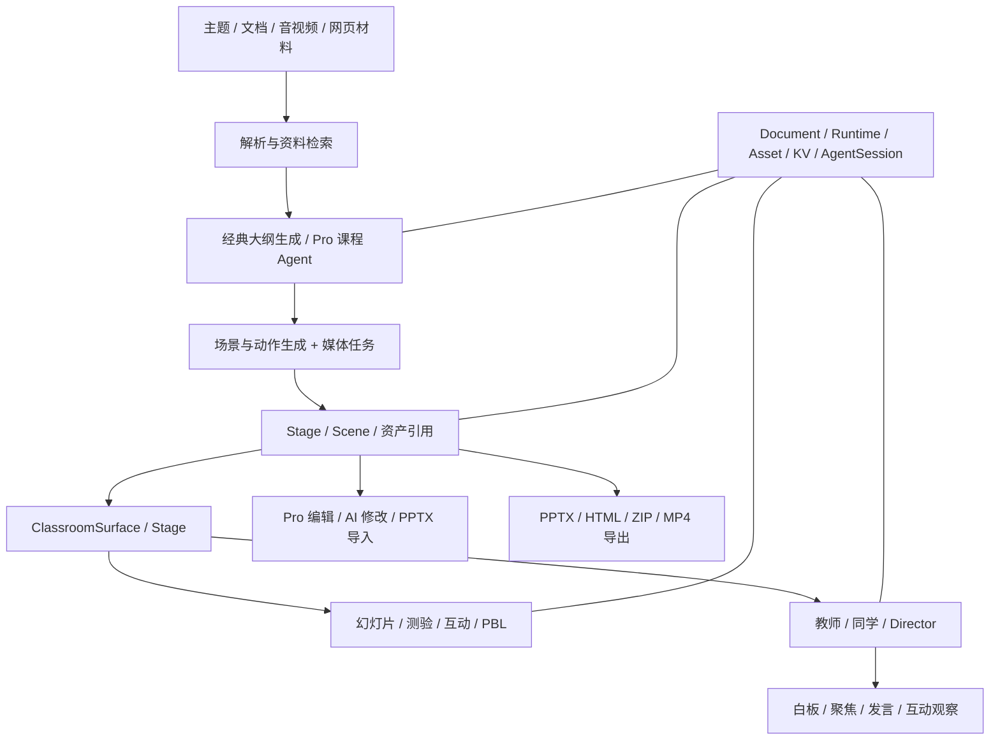

# OpenMAIC 深度剖析与全功能对齐

基线分析日期：2026-10-03；项目状态复核：2026-10-06（HEAD `9b74a25`）。分析对象：用户提供的 `F:/file/OpenMAIC-main` 本地源码。`package.json` 为 **1.1.1**，Next **16.3.3**、React **19.2.3**、pnpm **10.28.0**、Node 要求 **≥22.19.0**。README 的旧发布介绍不能替代此版本事实。

**最新产品要求：学科备考工作台最终必须具有该基线的全部产品能力，再叠加备考领域、来源治理与桌面能力。** 分阶段安排不等于删除功能。此前规格中「仅二维」「编辑器扩展后做」「同学零至两名」等是早期范围；最终产品应支持完整互动类型、完整编辑与可配置多角色能力，零至两名仅保留为默认备考配置。

这是源码分析和功能要求，不是「所有功能已经运行通过」的证明。当前实现缺口与待验收项见[待办事项](待办事项.md)；本文件继续作为 OpenMAIC 功能基线参考。

## 1. 项目规模与核心判断

本地代码包含 **70 个 API route 文件、366 个 components 下的 TS/TSX 文件、689 个 lib 下的 TS/TSX 文件、809 个 tests 下的 TS/TSX 文件**。这些数字按目录与后缀计数，不代表功能数或测试用例数。根包有 132 个生产依赖、32 个开发依赖。

OpenMAIC 是一套「内容生产 + 课堂执行 + 编辑 + 资源 + 持久任务」平台。它有两条主要使用路径：

1. **经典生成路径**：输入主题/材料 → 生成大纲 → 调整大纲 → 分场景生成内容、媒体与授课动作 → 进入课堂。
2. **Pro 工作台路径**：在会话中向课程 Agent 提要求 → 检索/解析资料并选择 skill → 创建或修改课程 → 持久事件回传 → 工作台直接挂载真实课堂和编辑器。

进入课堂后，课件播放、教师讲解、实时讨论、白板、本人测验、互动与 PBL 使用各自的运行机制。生成任务完成并不等于学习完成；恢复一次课程生成会话也不等于恢复全部课堂状态。

## 2. 架构与复用层次

六个 `@openmaic` SDK 工作区包承担不同责任，不能只复制几个 React 组件：

| 包 | 实际责任 | 本项目复用办法 |
| --- | --- | --- |
| `dsl` | Stage、Scene、幻灯片元素、动作、文档/运行时版本与校验 | 保留公共结构；项目、来源、审核、发布映射放侧表 |
| `renderer` | 可复用课件渲染 | 复用并适配主题与本地资产地址 |
| `generation` | 从模型能力生成大纲、场景、动作 | 输入换成准入证据包，生成结果先作为草案 |
| `editor` | 编辑器与相关模型/操作 | 保留编辑功能，编辑已发布课件必须建立新草案 |
| `importer` | PPTX 等内容转换 | 导入结果作为待核内容，登记文件与资产来源 |
| `storage` | 文档、运行记录、资产、KV 的接口及浏览器/HTTP/Postgres 实现 | 接口合同复用；桌面默认实现为 SQLite + 项目资产目录 |

根应用另有 `lib/chat`、`agent-runtime`、`pbl`、`whiteboard`、媒体、搜索、文档和导出模块；它们不会因安装 SDK 自动出现在本项目里。

真实课堂入口是 [ClassroomSurface.tsx](F:/file/OpenMAIC-main/components/classroom/ClassroomSurface.tsx)。其 `page` 和 `pane` 两种宿主使用同一课堂代码，Pro 工作台不是另一套静态预览。此文件负责课程加载、可用性重试、生成恢复和舞台挂载。四类场景分派见 [scene-renderer.tsx](F:/file/OpenMAIC-main/components/stage/scene-renderer.tsx)，公共场景类型见 [stage.ts](F:/file/OpenMAIC-main/packages/@openmaic/dsl/src/stage.ts)。

## 3. 必须对齐的产品能力

下表覆盖产品族，当前项目栏的删除线只确认有消费者/回归的软件子项，未划线部分是剩余实现或验收；不表示完整功能族或 OMA ID 签核。具体证据见[收尾记录](closeout-2026-10-06.md)、[开工清单](开工任务清单.md)，更细的交付项、来源目录和验收要求保存在 [openmaic-feature-parity.json](openmaic-feature-parity.json)。所有条目必须有可运行实现和验收证据，按钮、占位页面、接口名或 schema 不计完成。

| 功能族 | 上游具备的能力 | 当前项目情况 | 最终要求 |
| --- | --- | --- | --- |
| 课程库 | 课程列表、文件夹、课程归档管理、删除与课程访问状态 | ~~项目内课程浏览/搜索/筛选、文件夹创建/重命名/归组/取消分组~~；跨项目/全局库、课程发布访问状态及完整组织验收保留 | 项目内保留完整课程库和组织能力 |
| 经典生成 | 主题/资料输入、大纲生成与修改、逐场景生成、媒体任务、失败重试与继续 | ~~来源受控课件/陈述改写候选、人工审核、冻结发布与请求重试~~；完整经典大纲/互动/PBL/资产生成和真实 provider 整课保留 | 完整保留；来源不足只阻断受影响内容 |
| Pro 工作台 | 对话规划、持续修改课程、真实课堂嵌入、会话资料、工具与技能 | 基础备考工作台已有；课程 Agent/Pro 会话材料、工具和 24 skills 未实现 | 增加真正的课程 Agent 工作台 |
| 持久 Agent | 会话/消息/事件、取消、续跑、接管、后台生成与资料提取 | ~~基础备考 run、课堂 session、事务收据与模型派发台账~~；完整 Pro Agent/后台接管与恢复未实现 | 保持事件语义，服务重启可恢复，不伪造进度 |
| 幻灯片 | 文字、图片、公式、图形、表格、图表、富文本、媒体与授课动作 | ~~真实 DSL/SlideCanvas、固定图片/公式字体、正式文字/布局与来源审核装配~~；完整元素/媒体/授课动作生成保留 | 复用真实 renderer 与 DSL，支持完整课件 |
| 课件编辑 | 拖动、缩放、旋转、多选、内容样式编辑、场景增删排序、AI 修改 | ~~稳定场景增删/排序/复制、局部改写/重生成、元素富文本/样式、撤销恢复和差异/冲突预览~~；完整画布编辑/三向冲突解决保留 | 保留完整 Pro 编辑与 AI 编辑，不降级为文本框 |
| 教师与同学 | 多角色、人设、问答、课堂讨论、圆桌讨论、工具动作 | ~~持久教师会话/已审核讲解/本人等待、AI 同学开关与有限服务调度、模拟分区~~；完整 Director/多角色/受控模型讨论保留 | 完整课堂互动；角色配置不授予额外领域权限 |
| 白板与聚焦 | 写文字/公式/图形、逐步推导、聚光灯、激光笔、动作播放 | ~~已审核白板文字/公式/图形持久动作、真实元素聚焦、激光笔撤回/回放~~；完整编辑、整应用故障回放保留 | 真实动作执行与恢复；来源和动作收据可追踪 |
| 测验 | 单选、多选、简答、判分反馈、提交状态、课程完成反馈 | ~~单选/多选服务判分、简答待判分/模型候选/人工审核、不可变本人提交与答案展示规则~~；真实模型语义评分与安装态整课保留 | 完整题型与反馈；本人和 AI 演示始终分区 |
| HTML 互动 | 生成交互页、iframe 隔离、状态观察、教师引导与界面操作 | ~~固定与正式受控互动、iframe 隔离/观察消息校验、服务核验本人提交~~；完整通用 HTML 生成/运行/现场恢复保留 | 完整保留，并加项目/场景/版本消息校验 |
| 深度互动 | 3D 可视化、模拟实验、知识游戏、导图/关系图、编程、步骤技能训练 | ~~线性/二次参数实验、概念关系与排序审核组件~~；3D/游戏/编程/步骤技能及六类完整能力保留 | 六类全部纳入目标，不只交付两种二维演示 |
| PBL v2 | 角色、项目、阶段目标、任务、交付物、模拟器、导师与评价 | 计划/DSL 可表示相关场景，不计完整 PBL；真实任务/里程碑/交付物/导师评价未实现 | 正式项目学习入口、持久任务与本人交付记录 |
| 文档资料 | 文档上传/抽取、PDF/OCR、PPTX、网页、音视频转写/关键帧、会话材料 | ~~txt/md 严格 UTF-8 导入、原始字节归档与历史段落定位~~；PDF/Office/OCR/网页/音视频/PPTX/会话材料保留 | 完整资料链；抽取正文作为证据候选 |
| 搜索与核查 | 多搜索 provider、深度研究、资料检索、事实检查 | 未接入 | 搜索结果入材料/候选，不能直接提升为知识权威 |
| 模型配置 | 多 LLM/provider、兼容 API、本地模型、思考配置、按阶段路由与连接检测 | ~~兼容文本接口配置、受控凭据保护与连接诊断~~；多 provider/本地模型、按阶段路由与真实整课验收保留 | 保留可替换能力与检测，桌面密钥由主进程保护 |
| 媒体生成 | 图像、视频、ComfyUI 等适配、媒体任务进度、资源引用 | 未接入 | 生成、失败、重试、取消和落盘资源完整 |
| 语音 | 教师/讨论 TTS、语速、音色选择、描述音色/克隆、麦克风 ASR | 未接入 | 完整保留；语音不可用时文字课堂仍能运行 |
| 导入导出 | PPTX、互动 HTML、完整课堂 ZIP、离线资源内联、MP4 | ~~本地完整项目备份/恢复、已发布课件静态 HTML/ZIP、正式绑定图片内联和资源缺口清单~~；互动离线运行/提交、ZIP 导入、PPTX/MP4 和完整资源内联保留 | 真正可编辑/可播放/可导入的产物，全资源可追踪 |
| 外观与操控 | 暗色、主题、播放控制、沉浸、快捷键、响应式与多语言 | ~~三主题/外观阅读偏好存储、基础课堂播放控制与实际页面消费~~；完整视觉/DPI/键盘矩阵、沉浸和 12 locale 保留 | 保留完整操控和 12 个 locale 的国际化能力 |
| 用量与配置 | LLM/图像/视频/TTS/ASR 用量、provider 配置、检测与预设 | ~~共享文本模型调用/token/时间预算台账、取消和未知用量状态~~；完整多模态用量、费用依据、冻结配置归属保留 | 用量可核对，再增加本项目累计预算与成本规则 |
| 持久化与共享 | 浏览器/HTTP/Postgres 后端、课程发布状态、所有者、匿名认领、共享部署扩展点 | ~~本地 SQLite Document/Runtime/Asset/KV、冻结版本/收据与备份；新增独立协作服务/身份/邀请/公共场景/消息链路~~；完整上游后端/所有权/匿名认领、部署/真人双设备及通用恢复保留 | 默认本地；保留后端接口与可选共享/同步能力 |
| 外部 Agent 接入 | OpenMAIC skill、课程生成任务 API、外部工作台使用流程 | 未接入 | 有文档、有受控 API、有可安装技能包 |

## 4. 深度互动与 PBL 不能混为一项

[widgets.ts](F:/file/OpenMAIC-main/lib/types/widgets.ts:202) 的实际 union 有 **六类**：simulation、diagram（含 mindmap）、code、game、visualization3d、procedural-skill。README 展示的五大类之外，还必须对齐步骤技能训练。编程类型声明包括 Python、JavaScript、TypeScript、Java、C++；**声明可用语言不等于所有语言都有随包离线编译器**，桌面验收必须逐一检查实际执行后端与依赖。

互动至少包含「生成代码/HTML」「iframe 运行与资源」「教师观察/操作」「用户提交」「恢复与导出」五个环节。只显示 Three.js 图片或拖动滑块不能声称对齐整类能力。需要离线播放时，Three.js、KaTeX、字体、脚本和图片也必须随资源包可用。

PBL 是第四类正式 Scene；与普通互动不同，它还涉及项目角色、里程碑、任务与成果、评价及模拟器。其 API 有 `open-task`、`task/update`、`instructor`、`evaluate`、`simulator`。本项目需要把项目任务关联到科目、知识与证据，AI 协作产物和本人的交付分别记录。

测验源代码的题型是 `single / multiple / short_answer`；单/多选按答案集比较，简答走模型判分。模型判分失败后的上游降级行为需要独立评估，本项目应保留「待判分/待确认」状态，不能把服务失败解释成本人已经掌握。具体入口见 [grading.ts](F:/file/OpenMAIC-main/lib/quiz/grading.ts:67) 和 [quiz-grade/route.ts](F:/file/OpenMAIC-main/app/api/quiz-grade/route.ts:92)。

## 5. Pro Agent 与 24 个内置 skill

本地 `skills/agent-runtime` 确实有 24 个技能目录：

`build-personal-skill`、`curriculum-planner`、`deep-interactive`、`deep-research`、`fact-check`、`feynman-learning`、`k12-core-literacy-planning`、`learning-to-learn`、`lecture-style`、`page-clone`、`pptx-import`、`pro-editing`、`slide-craft`、`slide-dsl`、`social-emotional-learning`、`spiral-curriculum`、`stage-design`、`stage-dsl`、`style-clone`、`teacher-style-clone`、`understanding-by-design`、`vocational`、`workshop-style`、`zone-of-proximal-development`。

它们覆盖课程规划、教学策略、资料研究、课件制作、互动、PPTX 导入、编辑与个性化能力。应保持技能加载/版本/用户自定义和应用工具能力；不能只把 24 份 Markdown 放进目录就算实现。`fact-check` 或检索 skill 本身也不是语义正确性的确定性证明，本项目人工审核和证据准入仍须独立执行。

生成 Agent 和课堂 Agent 也要区分：前者创建/编辑课程，后者组织讲解/讨论/教学动作。它们的任务状态、工具权限和预算分别记录，并通过受控课程文档与发布映射连接。

### 三条运行路径的恢复能力

| 路径 | 实际实现 | 恢复边界与本项目要求 |
| --- | --- | --- |
| 经典课程生成 | JSON job 文件保存状态，进程内 runner 管任务；超过时限的遗留任务会标失败 | 保存任务状态不代表进程重启后自动接管；需给本地任务定义失败/重试/接管语义 |
| Pro 课程 Agent | PostgreSQL 会话、消息、单调事件序号、租约领取/续租、取消、续跑、干预与 ask-user；SSE 按事件 ID 回放 | 桌面 SQLite 适配保留租约和序号语义，重启后避免双执行、重复工具效果与漏事件 |
| 课堂 Director | `/api/chat/pi` 的请求级流式循环，客户端传课堂状态，调度 `read_scene/call_agent/cue_user/close_session` | 不等于 Pro 持久 Agent；讨论、白板、作答、互动各自需要恢复合同 |

关键源码：[classroom-job-store.ts](F:/file/OpenMAIC-main/lib/server/classroom-job-store.ts:45)、[agent-session/pg.ts](F:/file/OpenMAIC-main/packages/@openmaic/storage/src/agent-session/pg.ts:684)、[events/route.ts](F:/file/OpenMAIC-main/app/api/agent/sessions/[id]/events/route.ts:62)、[director-loop.ts](F:/file/OpenMAIC-main/lib/chat/pi/director-loop.ts:138)。具体服务的授权、序号与回放必须从冻结源码接入。

Pro runner 默认扫描/租约/续租、并发和重试均可配置，见 [config.ts](F:/file/OpenMAIC-main/lib/server/agent-runtime/config.ts:5)。上下文压缩是配置能力，默认关闭，不能把存在压缩代码解释成所有运行都已开启。续跑还会修复 transcript 尾部未配对工具调用并保留用户等待状态，见 [resume.ts](F:/file/OpenMAIC-main/lib/server/agent-runtime/resume.ts:93)。

白板持久操作按 owner/learner 和预期序号检查重放，而白板打开/关闭等 UI 命令不能统称数据库事实。播放检查点与 device KV 光标也不同于 Pro 的持久事件流；这些状态必须按故障点分别验证。

## 6. 存储与身份：复用合同，适配桌面后端

上游 [storage/README.md](F:/file/OpenMAIC-main/packages/@openmaic/storage/README.md) 和实际后端实现提供：

- **DocumentStore**：Stage/Scene/大纲文档、DSL 校验迁移、修订与冲突；不是「一个 JSON 保存课程」那么简单。
- **RuntimeStore**：以 `(stageId, learnerKey)` 分区的会话与追加记录，存储分配单调 `seq`；包含聊天、测验与播放事实。
- **AssetStore**：不透明 assetId、元数据、内容摘要、字节、替换、引用、配额与回收。文档引用资源 ID，不能持久保存过期 URL。
- **KV**：device/account 的非事实设置；设备偏好与账号同步数据不同。
- **AgentSession / Material / Skill**：Pro 会话、消息事件、资料提取与用户技能需要额外持久化，不在基础测验表中自动获得。

浏览器默认后端与 HTTP/Postgres 是不同部署方式。当前本项目既定「本地服务唯一写库」不能回退成 IndexedDB 和 SQLite 双权威。正确路径是适配相同接口，在本地服务实现 SQLite/资产目录；可选云同步与共享部署仍保留为功能目标。

上游所有者认证是宿主扩展 seam，不等于自带完整账号网站。匿名认领会迁移课程、文件夹、材料、会话、技能、运行记录和资产；共享团队与外部认证要由宿主配置。本项目本地单用户仍要明确 projectId、打开代次、真实 learnerKey；开放共享模式时再启用账号/所有者能力，不能用浏览器自由提交身份。

功能还受启动配置控制：[feature-flags.ts](F:/file/OpenMAIC-main/lib/config/feature-flags.ts) 将服务端持久化、Agent runtime、Pro 工作台、编辑器和实验 renderer 分开设门槛。Pro 工作台公开标记和服务端 runtime 必须共同可用。Pi 课堂聊天默认为启用，新 playback/editor renderer 属实验开关。功能对齐要求完整行为，不要求同时维护所有旧/新内部实现。

公开课程、访客水合等能力还要区分本地源码和在线示范站；`ClassroomSurface` 注释明确一些线上站专用访客/上传机制不在这个工作区。功能对齐基线是用户的本地源码，不能将官网额外私有功能写成已在本地仓库存在。

## 7. 媒体、离线与外部依赖

| 能力 | 需要的资源/服务 | 桌面适配重点 |
| --- | --- | --- |
| 文本模型/搜索 | provider endpoint、连接配置；可选本地服务 | 密钥不进渲染层；私网/回环服务按明确配置授权 |
| PDF/OCR | 本地解析或 MinerU/AliDocMind 等后端 | 解析任务可取消，保留原件和来源位置，云发送有明确选择 |
| 音视频资料抽取 | 可选 FFmpeg/FFprobe + ASR，或云解析 | 不把系统已安装工具当随包依赖；缺失时明确错误 |
| TTS/ASR | 多 provider；可选 Lemonade、FunASR、VoxCPM | 预生成音频可离线播放，在线生成与离线播放状态分开 |
| 图像/视频生成 | 模型/API/本地工作流 | 资产持久落盘，原资源/失败原因/生成状态可核对 |
| MP4 导出 | 上游独立 render-service，Chromium + FFmpeg | 是单独分发与资源任务，不能只接一个下载按钮 |
| 离线 ZIP/HTML | 资源抓取与内联 | 上游抓取失败会保留原 URL，必须报告未离线资源，不能无条件承诺全离线 |
| 编程/3D 互动 | 语言执行资源、Three.js 等 | 检查实际运行方式、随包资产与受限执行；不向 iframe 开放 Node |

来源见 `lib/document`、`lib/media-parse`、`lib/audio`、`lib/media`、`lib/export`、`lib/video-export`、`render-service` 相关目录。provider 名单随冻结版本保留，以注册表为准，不依赖宣传文案中的模型名。

### Provider 与模型路由

冻结源码类型与注册声明包含：20 个内置 LLM provider（另支持自定义）、10 个 TTS（另支持自定义）、6 个 ASR（另支持自定义）、9 个图像、7 个视频、9 个搜索和 4 个 PDF 解析 provider ID。完整 ID 已写入机器清单的 `providerBaseline`；这些是声明/适配范围，**不是全部实机连接成功的证明**，不能保证供应商当前仍可用或收费规则不变。

搜索声明包含 Tavily、Exa、Bocha、Brave、Baidu、Claude、MiniMax、Doubao 和 SearXNG。语音包含浏览器/云/本地服务等不同方式；音色克隆需要指定 provider 与注册步骤，浏览器语音也取决于宿主支持，不能据此笼统保证离线语音。

普通生成阶段模型选择顺序为：服务端 `MODEL_ROUTES` → 用户分阶段配置 → 主模型 → 默认模型，见 [resolve-model.ts](F:/file/OpenMAIC-main/lib/server/resolve-model.ts:70)。Pro 的 `maic-agent-driver` 显式选择 provider 与 Pi 模型方言，使用独立解析逻辑且不复用相同默认回退，见 [agent-driver-model.ts](F:/file/OpenMAIC-main/lib/server/agent-runtime/agent-driver-model.ts:48)。桌面不能把所有生成/课堂/Pro 功能都硬编码到一个模型入口；用户仍可选择统一模型，但必须保留按阶段配置和正确的失败提示。

导出还需准确区分：源码确认 PPTX、包含互动 HTML 的 resource pack、完整 `.maic.zip` 及 MP4 流程；本轮未发现独立的「整门课程单个 HTML」入口。因此全功能对齐中的 HTML 指互动资源/资源包能力，不能冒称上游已经有整课 HTML 导出。MP4 通过独立 render-service 上传包、轮询任务和下载；不是浏览器原生直接编码。

## 8. 本项目必须增加的证据与执行规则

上游的文档校验、内容清洗和多角色工具权限不能自动满足学科备考证据合同。需要从一开始加在适配边界：

1. 主题、搜索、导入文档、生成幻灯片/HTML/PBL/测验都先成为候选/草案，正式发布引用核实证据。
2. 课程冻结文档版本与知识/材料版本；原文更新后，受影响场景、题目、白板及教师动作失效。
3. 模型只提候选；人工审核入口不能注册成模型工具。角色人设和用户 style 输入不能改变权限。
4. 教师/同学/Director/编辑 Agent 共用来源守卫；skill 和导入也不能旁路。
5. 同学模拟答对不提高本人掌握；测验、PBL 交付和互动完成都由服务绑定本人身份并核验。
6. 提交、白板动作和任务继续使用收据/序号，断连后先查询既有结果，再决定是否续跑。
7. 课堂恢复按文档、讨论/白板、作答、互动分别验收；后台 Agent 可恢复不代表任意 iframe JS 现场可恢复。
8. 搜索、TTS、3D、任意 HTML 等功能全部保留，但每种能力必须具有自己的资源/运行/证据边界。

## 9. 实现顺序与完成定义

最终功能范围已经扩大；旧的 10—12 周估算对应早期缩小范围，**不能继续当全功能交付承诺**。先按复用试验校准工程量，不给未经验证的新工期或完成百分比。

| 交付批次 | 实际产物 | 进入下一批前的验收 |
| --- | --- | --- |
| A：真实课堂与桌面资源 | 固定基线、DSL/renderer/storage 适配、真实 ClassroomSurface、四场景基本挂载、随包 Node | 安装后不用开发 Node；字体/媒体正确；本人提交重启可读 |
| B：课程生产与编辑 | 经典生成、资料提取、大纲、四类场景生成、完整编辑器/PPTX 导入 | 草案→审核→冻结发布，重试/取消/失败恢复及资源引用完整 |
| C：教师与互动 | Director/教师/同学、白板/聚焦、完整测验、六类深度互动、PBL v2 | 真实动作、本人等待、角色关闭/配置、服务核验、来源侧表 |
| D：Pro 工作台与技能 | 持久 Agent 会话、会话材料、工具、24 skills、自定义技能、课堂嵌入 | 重启接管、取消/继续/干预、旧项目响应拒绝、预算有记录 |
| E：媒体与可移植产物 | 多 provider、TTS/ASR/音色、图像视频、HTML/ZIP/PPTX/MP4 | 真正可编辑/可播放/可重新导入；离线资源缺口可见 |
| F：全功能交付 | 课程库、国际化、共享/同步适配、用量、完整恢复、体验与安装验收 | 清单全部有证据；来源攻击、身份隔离、异常与资源矩阵通过 |

媒体/模型基础接口会在 B/C 前按依赖提前实现，以上不是严格串行代码分工。M0 仍是当前第一道门槛；不能因为全功能目标扩大而跳过打包和真实课堂验证。

每个条目完成至少需要：真实入口、实际运行代码、服务持久记录（若有事实/资产）、必要确定性回归、运行演示及限制说明。`partial`、`planned`、缺 provider 或占位都不计完成。
