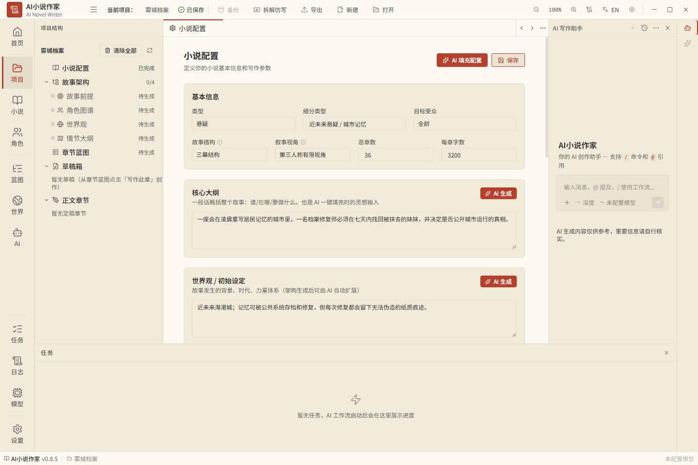

# 界面设计与风格定制规范

版本：v0.3（界面已实现子项与走查边界）；日期：2026-10-06。对应 Electron 桌面版，搭配 [开发设计](Electron开发设计.md)、[课堂规格](OpenMAIC复用与学习空间.md) 与 [设计令牌](设计令牌.json) 使用。

## 0. 界面子项完成标记

删除线只确认有实际页面/消费者及回归的软件子项；整体视觉、三主题、DPI/窄窗和完整键盘体验仍按第 10 节走查，不能由 schema 或页面存在替代。证据见[开工清单](开工任务清单.md)、[收尾记录](closeout-2026-10-06.md)。

| 页面/行为 | 已核对子项 | 剩余验收/实现 |
| --- | --- | --- |
| 工作台来源/审核 | ~~科目、材料/段落/归档原文查看、知识/题目人工核验与计划确认页面~~ | 正式科目材料、安装态原文/审核及完整导航/键盘 |
| 设置 | ~~三主题与外观/阅读/教学偏好的版本化存储、界面消费和重启读回~~（[偏好回归](../tests/persisted-teaching-preferences.test.ts)） | 三主题全页视觉、DPI/窄窗、面板/快捷键全矩阵及安装态走查 |
| 正式课堂 | ~~本人/AI 分区、已审核讲解与等待、三题型提交、参数/关系/排序互动、聚焦/激光撤回回放~~ | 完整 Director/讨论、六类互动/PBL、整应用故障及真人走查 |
| 编辑/课程库/导出 | ~~稳定场景与元素样式编辑/撤销、项目内课程搜索/文件夹组织、静态导出及缺口提示~~ | 完整画布/冲突解决、全局库/访问状态、PPTX/MP4/ZIP 导入与完整离线资源 |
| 共同课堂 | ~~UID 激活/本人认证、邀请/准备/开始、双端公共内容/当前场景、真人文字消息及重试状态~~ | 公共教师/AI 消息与白板同步、真人双设备/跨设备恢复；个人档案/剪贴板偶发异常继续取证 |


## 1. 视觉定位与参考

定位为安静、适合长时间阅读的学科备考工作台。保留参考界面的纸质感、紧凑工具栏、明确的项目结构和文档中心布局，重点让学习者能阅读、作答并核对依据。

参考截图：



截图中的暖米色侧栏、较浅中央文档、朱砂主按钮、细线分区及底部任务区域，构成设计参考。截图显示 v0.8.5；本地项目 v1.1.0 还提供纸色等主题、分开的界面/正文字体及面板设置，不能把本地实现与截图逐像素等同。

本作品的品牌使用“学科备考工作台”，图标可采用书页与核对标记的自有组合。文案、模块及图标按学习任务重新设计。

设计准则：正文为视觉中心，来源易于找到，审核结果明确，操作尽量连续。颜色表达信息，但“已核实”“待核实”“未作答”等状态同时使用文字与图标，不用装饰动画替代实际进度。

## 2. 桌面布局

### 2.1 总体结构

```text
┌──────────────── 顶部：项目、导入、保存草稿、导出、窗口控制 ────────────────┐
│活动栏│  科目项目树   │   中央标签页：知识 / 计划 / 今日学习 / 错题   │右侧工具│
│      │              │──────────────────────────────────────────│        │
│项目  │材料与考纲    │                                          │AI 助手 │
│知识  │已核实知识点  │              文档与学习主区              │来源    │
│计划  │待审核候选    │          讲解、例题、练习、原始作答        │审核    │
│学习  │学习日与错题  │                                          │        │
│错题  │              │                                          │        │
│评测  ├──────────────┴──────────────────────────────────────────┴────────┤
│设置  │           底部抽屉：任务 / 日志 / 模型连接                       │
├──────┴─────────────────────────────────────────────────────────────────┤
│ 状态栏：项目位置 / 草稿状态 / 本次学习状态 / 模型连接                    │
└────────────────────────────────────────────────────────────────────────┘
```

默认窗口建议 1440 × 960。尺寸为设计初值，可以按实际显示与可用宽度调整：

| 区域 | 默认尺寸 | 行为 |
| --- | --- | --- |
| 顶栏 | 44 px 高 | 左侧品牌与项目；中部主要操作；右侧窗口按钮 |
| 活动栏 | 64 px 宽 | 图标加短标签，选中项左侧有 3 px 强调线 |
| 项目树 | 240 px 宽 | 可拖动至 180—360 px，可折叠 |
| 中央标签栏 | 36 px 高 | 当前标签有强调线，草稿修改用独立标记 |
| 中央工作区 | 使用剩余宽度 | 文档为主，禁止因固定侧栏把正文压到无法作答 |
| 右侧面板 | 300 px 宽 | 可拖动至 260—440 px；AI/来源/审核切换 |
| 右侧工具轨 | 32 px 宽 | 打开指定面板，窄窗口可合并为顶栏入口 |
| 底部抽屉 | 默认折叠为 28 px；展开约 200 px | 可拖动，展开不遮挡正文最后一项 |
| 状态栏 | 24 px 高 | 展示服务确认的领域状态及主进程窗口/服务状态，不展示猜测进度 |

在 1440 px 宽度下，默认中央区域约 804 px。底部任务抽屉在实际长任务时允许用户展开；普通阅读保持折叠，避免像参考截图中的空任务面板长期占据阅读空间。

### 2.2 导航语义

| 截图中的职责 | 本作品模块 | 可见内容 |
| --- | --- | --- |
| 项目结构 | 科目项目 | 材料、考纲、知识、计划、学习日、错题 |
| 章节蓝图 | 学习计划 | 阶段目标、每天任务、复习与缺口 |
| 正文编辑区 | 文档与学习区 | 讲义、练习、作答、审核预览 |
| AI 写作助手 | AI 学习助手 | 提问、补讲、提出候选及调整建议 |
| 任务与日志 | 运行记录 | 真实步骤、等待条件、取消、继续执行 |
| 小说配置 | 科目设置 | 目标、时间、水平、教材版本和表达风格 |

活动栏优先保留项目、知识、计划、课堂、错题、评测；底部放设置。“课堂”是学习空间，今日学习从计划或课堂首页进入。材料通过项目树进入，任务/日志/模型通过底部入口进入，避免复制参考项目全部导航项。

### 2.3 窄窗口与缩放

以实际布局的可用 CSS 宽度判断，不能仅用显示器物理像素判断。窗口缩放和系统 DPI 都纳入验收。

- 宽度不低于 1280 px：项目树、中央区和右侧面板同时呈现。
- 800—1279 px：右侧工具按需打开抽屉，中央区优先保持至少 480 px；项目树不足时自动收起。
- 低于 800 px：项目树与右侧工具切换为覆盖抽屉；中央区独占主要宽度，主要操作通过工具菜单访问。

覆盖抽屉关闭后恢复原焦点。来源核对支持抽屉固定和“返回候选”，不能因为窄窗口让审核按钮或原文不可访问。项目树、正文与右侧面板分别滚动；不得出现整窗与正文双重垂直滚动。

## 3. 配色与设计令牌

默认采用“纸色”，另外提供“浅色”“暗色”和“跟随系统”。跟随系统映射浅色/暗色；纸色是显式选择，重启或升级不得自动改变。

以下颜色是根据参考重新定义的本项目初始令牌，不是逐行复制参考 CSS：

| 语义 | 纸色 | 浅色 | 暗色 |
| --- | --- | --- | --- |
| 应用底色 | `#F7F3E8` | `#F5F6F7` | `#202321` |
| 侧栏/任务区 | `#EFE9D9` | `#ECEFF1` | `#272B28` |
| 中央阅读页 | `#FFFDF7` | `#FFFFFF` | `#1B1F1C` |
| 卡片 | `#F3EDDD` | `#F7F8F9` | `#292E29` |
| 主要文字 | `#292720` | `#24282D` | `#EDEFE8` |
| 次要文字 | `#625E54` | `#59636F` | `#BAC3B8` |
| 辅助文字 | `#6B6558` | `#626B75` | `#A2AD9F` |
| 细分隔线 | `#DDD5C4` | `#DDE1E6` | `#444C43` |
| 强调色 | `#B64532` | `#A93F2E` | `#E09A83` |
| 强调按钮文字 | `#FFFDF7` | `#FFFFFF` | `#241F1B` |

组件使用 `surface.*`、`text.*`、`action.*`、`status.*` 等语义变量，不能在页面里散落硬编码色值。[设计令牌.json](设计令牌.json) 是初始数据合同；具体 CSS 变量由渲染层转换。

普通正文和关键操作文字对比度建议至少 4.5:1，焦点环和关键交互边界建议至少 3:1；细装饰分隔线与交互边界分开处理。内置主题在实现后对实际渲染状态验收，不能只验证颜色表。

朱砂色用于当前导航、主要动作及选中强调；错误另有错误语义色和明确文字。等待核实用琥珀色，来源已核实用绿色，未测或未作答用中性颜色。用户修改强调色不能改变状态标签含义。

## 4. 字体、密度与组件

界面默认使用系统无衬线字体，Windows 优先系统 UI 与中文字体回退；正文可选系统无衬线或系统衬线。首版不依赖联网加载字体，补充字体时随应用打包并登记来源。

| 项目 | 默认 | 可调范围 |
| --- | --- | --- |
| 界面基础字号 | 14 px | 通过界面缩放统一调整 |
| 正文阅读字号 | 18 px | 16—24 px |
| 正文行高 | 1.8 | 1.5—2.0 |
| 文档一级标题 | 26 px | 随界面/正文层级保持比例 |
| 文档二级标题 | 20 px | 保持层级 |
| 元信息 | 12 px | 禁止用极小字承载关键来源或审核结论 |
| 正文最大宽度 | 760 px | 640—920 px；不能超过中央容器 |
| 文档内边距 | 32 px | 窄模式 16—24 px |
| 卡片圆角 | 8 px | 首版固定 |
| 控件圆角 | 5 px | 首版固定 |
| 间距级别 | 4 / 8 / 12 / 16 / 24 / 32 px | 用统一间距变量 |

密度预设提供标准和紧凑。紧凑模式减少导航行高与卡片空隙，不降低阅读行高、不缩小来源字号。正文不使用花哨背景、强玻璃效果或持续运动。

按钮区分主操作、次操作、轻操作与危险操作。每张卡片原则上只有一个主要动作；图标为辅助，审核、发布、提交答案必须有完整文字。

知识点采用表格或分组列表，学习档案采用线性阅读结构，课堂使用场景画布，错题按逐题内容组织。复制代码和数学表达时保留文本原貌；正文允许 Markdown 数学表达的受控展示，基础档案导出仍为纯文本。

焦点环清晰，Tab 顺序跟随视觉顺序，弹窗标题可读，Escape 可关闭临时面板。动画只用于短暂打开/关闭反馈，建议 120—180 ms；减少动态效果设置下立即完成过渡。

## 5. 关键页面设计

### 5.1 科目设置

参考截图中的配置卡片：页面顶部显示标题与简述，右上角保存草稿；正文按目标与时间、材料与范围、学习起点、教学表达四组组织。

必须输入项标明用途，不要求在新建时填满所有字段。未配置模型显示“可先导入材料和整理项目”，模型设置按钮就近可达。页面保存设置不代表候选或课程已经审核通过。

### 5.2 材料与来源

列表显示材料名称、类型、版本、导入时间和状态。点击进入规范化原文与定位面板，段落编号可复制，点击引用能够滚动并高亮对应段落。

来源面板展示人可读位置、原文、材料版本、指纹摘要及“查看完整校验信息”。不把长哈希占满主要阅读区；用户可以一键核对原文。

### 5.3 知识清单与候选审核

“已确认”与“待审核”分别显示，候选计数不算知识覆盖数。列表至少显示编号、名称、来源状态、范围状态、掌握状态和下一步。

候选详情采用“拟加入的知识点 / 支持原文 / 审核结论”三部分。必须支持修正、拒绝、补材料与审核通过。来源不足时审核通过按钮不可用，并显示具体缺口。

已有知识点的修改显示旧值与新值差异。用户读过原文并作出语义判断后才可通过；单纯指纹一致只显示机械检查已通过。

### 5.4 备考计划

顶部显示目标、剩余时间和范围缺口；正文使用阶段分组及逐日任务列表，不用复杂日历拖拽作为首版主功能。

每项明确知识点、用时与验收方式。缺材料的项位于待核范围，不能显示“开始学习”。计划调整在独立审核预览中展示受影响任务及依据。

### 5.5 今日学习

页首显示今日目标、计划用时、来源就绪情况及当前学习步骤。中央依次呈现必要前置、讲解、例题、独立练习和复盘。

例题解释按步骤展开；独立练习先显示题干和文本作答区，答案与解析默认折叠。用户提交后显示系统反馈及“请求提示”“看订正”“再做一道”等相关动作。

每道题始终显示原题、材料改写或 AI 新编标签；真题必须显示核实过的具体出处。标注位于题干附近，不藏在右侧面板或页尾。

答题草稿自动保存，并注明“草稿未提交”；点击提交后保存不可变作答记录。修改答案形成新的作答版本，不能覆盖原始错误过程。

老师对话围绕当前任务，支持“再讲一步”“给一个提示”“查看来源”。等待学生作答时显示明确状态，不能让自动播放的讲解跳过独立练习。正在生成的内容标为草案，审核发布后进入正式学习区。

### 5.6 错题本

以每题为单位显示原题、作答原貌、具体错步、错因与证据、完整订正、复做题与复做记录。待确认错因显示“依据不足，需要补充过程”，保留补过程入口。

用户确认的错因与 AI 提出的错因候选分别标注。模拟数据在专门标签页，颜色和文字共同提示，不进入实际掌握统计。

### 5.7 任务与评测

底部任务显示实际步骤、等待条件、失败原因、已提交结果，以及取消/继续。模型输出长度和调用次数可在详情查看，不能伪造递增百分比。

评测页每项显示分子、分母、结果和样本列表，支持打开失败案例。无来源注入用专门“评测项目”运行，避免把演示记录混入用户学习数据。

## 6. 外观定制

入口：设置 → 外观与阅读。默认状态可一键恢复；更改先预览，点击应用后通过受控设置接口保存，取消恢复进入设置前的配置。窗口/系统缩放由主进程处理，阅读/课堂视图偏好由本地服务持久化，不在两处双写同一字段。

| 设置 | 首版能力 | 保存范围 |
| --- | --- | --- |
| 主题 | 纸色、浅色、暗色、跟随系统 | 全局 |
| 强调色 | 朱砂、深青、靛蓝三个经过验证的预设 | 全局；各主题配套前景色 |
| UI 字体 | 系统无衬线，后续可加随包字体 | 全局 |
| 正文字体 | 系统无衬线 / 系统衬线 | 全局 |
| 正文字号/行距/宽度 | 按前述值域调整，提供样文预览 | 全局 |
| 界面缩放 | 80%—150%，步长 5%，可恢复 100% | 全局 |
| 密度 | 标准 / 紧凑 | 全局 |
| 面板 | 宽度、折叠、底部高度和专注阅读模式 | 全局或项目视图 |
| 减少动态效果 | 开启 / 关闭，默认尊重系统偏好 | 全局 |

专注模式收起项目树、右侧助手和底部抽屉，保留返回、今日步骤、提交答案及来源入口。离开后恢复原布局。

首版风格定制采用有范围的令牌，不允许导入任意 CSS、脚本、远程字体或插件。图片皮肤、自定义字体导入和任意色值选择属于 P2；如果以后加入，阅读区仍保留不透明背景，校验对比度与资源来源。

个性化设置只改变显示，不向 Markdown 产物注入颜色、字体或皮肤。知识编号、题目出处和实际作答不随主题变化。

## 7. 教学表达定制

入口：科目设置 → 教学表达。与外观分开，属于项目配置。所有选项提供一段同知识点、同来源的预览，用户能看出表达差异。

| 设置 | 首版值 | 约束 |
| --- | --- | --- |
| 学习模式 | 零基础 / 复习 | 零基础保留前置解释，复习压缩已确认熟练内容 |
| 解释方式 | 直观示例 / 逐步严谨 / 简洁回顾 | 条件与依据不能被省略 |
| 提示深度 | 轻提示 / 分步引导 / 完整解析 | 默认先等作答；用户明确要解析时可提供 |
| 例题与独练配比 | 讲解优先 / 均衡 / 练习优先 | 根据时间预算确定题量，保留反馈与订正 |
| 自我解释 | 默认开启，可关闭 | 开启时要求说明关键步骤理由，不改变知识事实 |
| 联系生活的例子 | 适量 / 少量 | 无来源的新学科结论仍需提出候选 |
| 额外表达偏好 | 最多 500 个字符 | 作为低优先级内容，不能指定工具权限或写事实 |

预设组合：入门讲清楚、复习抓重点、推导讲严谨。可以保存项目自定义组合，设置值仍受 schema 限制。

预览只帮助选择表达方式，不作为已发布讲义。使用尚未确认知识点时显示“先核实材料后才能生成教学预览”，不能借预览绕过准入。

每次 run 保存表达配置版本与哈希。运行期间修改后提示“下次任务生效”；已经发布的课程保持原版本，重新生成进入新的草案和审核流程。

优先顺序：来源与事实合同 → 用户当前任务和已确认目标 → 当前时间与学习模式 → 表达偏好。任何风格都不能臆造出处、伪装真题、模拟真实作答、授予掌握状态或省略导致误用的条件。

## 8. 状态、提示与示例文案

| 场景 | 推荐文案 | 可执行动作 |
| --- | --- | --- |
| 没有材料 | 导入考纲或教材节选，开始整理知识清单 | 导入材料 |
| 机械检查通过但未审核 | 引用可定位，等待核对它是否支持这个知识点 | 查看原文并审核 |
| 来源不足 | 缺少支持原文，暂不能用于课程和出题 | 补充材料 |
| 生成课程 | 正在整理课程草案，尚未发布 | 查看任务 / 取消 |
| 等待作答 | 请先提交你的解题过程，再查看反馈 | 提交答案 / 请求提示 |
| 没有解题过程 | 当前答案不足以确定错因 | 补充过程 |
| 中断恢复 | 已恢复上次提交的课程，继续等待你的作答 | 继续学习 |
| 发布完成 | 课程已发布，可开始学习或导出文本 | 开始学习 / 导出 |

使用“引用可定位”而不是“内容正确”，“草稿已保存”而不是“知识已确认”。不要在用户页面展示租约、ABI、tool_call 等实现细节；可核对的材料版本、来源位置与任务状态保留。

## 9. 学习空间、教师和虚拟同学设计

### 9.1 两种工作区共用一个桌面

备考工作台保留纸质文档布局；进入课堂后收起备考项目树，以课堂场景缩略导航替换。顶栏、活动栏、设置及来源入口继续使用同一套主题；底部任务抽屉默认折叠。离开课堂恢复工作台布局，不另开浏览器窗口。

```text
┌──────────── 项目 / 当前课程 / 发布版本 / 返回工作台 ───────────┐
│活动栏│ 场景导航 │      课件 / 白板 / 互动实验      │课堂讨论   │
│课堂  │目标     │      按原坐标比例适配画布       │老师 · AI  │
│知识  │讲解     │                               │同学 · AI  │
│错题  │实验     │  当前知识 / 来源 / 内容核实状态  │本人输入   │
│      │独练     ├───────────────────────────────┤           │
│      │复盘     │ 暂停 / 提问 / 提示 / 提交答案   │来源切换   │
├──────┴─────────┴───────────────────────────────┴───────────┤
│ 当前步骤 / 等待你的作答 / 保存状态 / 模型连接                  │
└────────────────────────────────────────────────────────────┘
```

1440 px 窗口课堂初值：活动栏 64 px、场景导航 200 px、讨论区 320 px；课件利用剩余区域。来源面板与讨论通过标签切换，避免再加第四个常开侧栏。窄窗优先保留画布和答案区，导航/讨论改抽屉；必要时画布与讨论切换。没有来源按钮、提交按钮被挤出窗口的布局不得通过验收。

### 9.2 课件和可视化的显示

复用 renderer 的逻辑坐标及宽高比例，布局缩放采用 fit/contain；不把正文 18 px 设置强制覆盖所有幻灯片坐标字号。课件必须另提供可选择/可复制的讲解文本及来源，供小屏与辅助阅读。主题改变外壳，已发布课件内容不自动改色重排；预设模板在生成时选配主题版本。

画布下方显示当前任务，例如“先预测，再调整参数观察”。实验参数区、预测、操作、解释按任务顺序排布，图形旁提供文字观察/数据表；有标准答案的任务等本人提交后再揭示。概念互动支持键盘替代拖拽，关系不能仅由红绿颜色表示。

互动场景始终有“重置实验”“查看依据”；跨进程不能恢复的组件显示重置提示，已保存答案单独保留。错误显示在场景内而非空白画布，含返回讲解/重试入口。

### 9.3 老师和同学的界面

老师默认是文字讲解与白板，头像使用自有简单图形或核对过许可的资产。角色栏显示“老师 · AI”“同学 · AI”，本人显示“你”。不暗示虚拟同学是真人或课程已通过专业机构认证。

讨论气泡显示发言者、角色、状态和来源入口；引用卡可展开原文。本人作答卡与老师/同学消息有不同类型标记。待核生成内容放独立待核卡，不展示成已完成授课；不能在检查前自动播放新生成文字的语音。

同学可选“追问条件”和“比较步骤”两种初始风格。同学预设不刻意插话或制造错误；错误演示采用明确标注的审核案例。独练期间同学不抢答，用户按“讨论这道题”才进入讨论。本人输入优先打断待执行同学轮次。

### 9.4 课堂定制

入口：科目设置 → 学习空间，也可从课堂顶栏快捷打开。先给默认可用课堂，再允许设置，避免开课前填写长角色表。

| 设置 | 默认及范围 | 生效与约束 |
| --- | --- | --- |
| 授课模式 | 教师讲解 / 独立学习 / 讨论，默认教师讲解 | 不修改课程来源；独立学习暂停自动角色轮次 |
| 老师风格 | 引导提问 / 逐步讲解 / 简洁复习，默认逐步讲解 | 影响表达和提示；新学科内容仍待核 |
| AI 同学 | 0—2，默认 1，可一键关闭 | AI 身份持续显示；角色不能提交本人答案 |
| 同学参与 | 安静 / 适量，默认适量 | 每轮发言上限，预算在所有角色间合计 |
| 白板 | 可用 / 隐藏，默认可用 | 隐藏不删除历史；同学默认无写权限 |
| 可视化 | 自动推荐 / 手动展开，默认自动推荐 | 只有审核后的关联场景可推荐 |
| 语音 | 默认关闭；P2 开启 | 缺语音不阻碍学习；有字幕/文本与停止入口 |
| 课堂专注 | 收起导航与讨论，默认关闭 | 保留返回、暂停、作答、来源和老师状态 |

已提交课堂内容固定版本。角色/表达修改从下一明确轮次生效并记录配置版本；改变课程内容需重新审核发布。主题、密度和讨论宽度可以立即预览。自由 persona 输入有长度限制，不能接受用户 CSS/脚本或赋予工具权限。

### 9.5 课堂状态文案

| 状态 | 显示 | 行为 |
| --- | --- | --- |
| 首次进入 | 正在打开已发布课程 | 展示真实服务/资产加载阶段 |
| 教师授课 | 老师正在讲解当前步骤 | 暂停、提问、查看来源 |
| 新回复待核 | 这段补充尚未核实 | 查看候选/补材料；不能当正式讲解播放 |
| 等待本人 | 轮到你了，请先提交预测或解题过程 | 同学停止抢答，焦点转到本人输入 |
| 同学演示 | AI 同学的模拟推理 | 不显示为“你已完成”或提高掌握率 |
| 来源失效 | 相关材料已更新，这一部分需要重新核实 | 暂停相关场景，返回来源审核 |
| 断网 | 已发布内容可继续阅读，在线提示暂不可用 | 手动学习/作答，保留草稿 |
| 恢复 | 已恢复本节课，继续上次等待步骤 | 已提交白板/作答不重复；组件重置单独提示 |

## 10. 设计验收

1. 截图参考风格能在纸色主题中辨认：暖纸外壳、较浅文档、朱砂动作、细分隔和紧凑导航。
2. 三个主题中，来源状态、题目出处和审核结论均可读；不能只凭颜色区分。
3. 缩放和窄窗口下，原文、候选差异、作答提交与审核按钮均可访问，没有文字截断导致含义改变。
4. 修改外观、重启后配置恢复；明确主题选择不被系统或升级覆盖。
5. 切换教学表达不会修改来源、知识点和掌握记录；运行配置可追溯，旧课程不会被静默改写。
6. 等待审核/作答和正式发布有清楚差异；草案不进入正式学习列表。
7. 无来源考点演示同时显示待核候选、未改变的权威清单和明确的任务阻断。
8. 课堂、工作台共用三套主题；课件不因阅读字号/主题改变逻辑坐标，文字讲解与来源可访问。
9. 老师/同学/本人角色一直可辨，同学关闭和独练不抢答有效；模拟内容不显示本人完成。
10. 两种互动有文字/键盘替代、来源、本人提交和恢复提示，窄窗仍能操作。

参考文件：用户截图；本地 AI-Novel-Writer 的 `src/index.css`、`src/stores/theme-store.ts`、`src/stores/layout-store.ts`、`src/components/settings/AppearanceSettings.tsx`；OpenMAIC 的 ClassroomSurface、stage/agent 组件、renderer 和互动容器。工作台令牌与学习交互由本项目定义，课堂基于上游组件适配；不复制参考产品品牌与小说数据。
