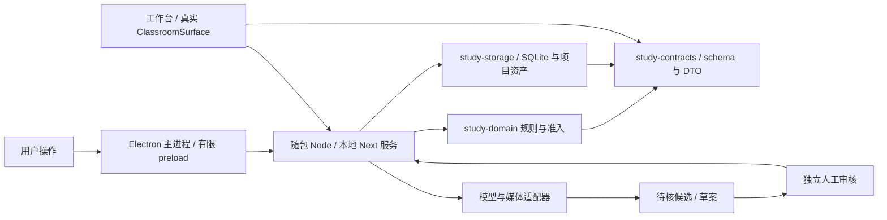

# 学科备考工作台规划书

版本：v0.6（可执行规划：备考闭环 + OpenMAIC 全功能对齐）  
日期：2026-10-03  
状态：持续实施；M0 尚未通过。本文中的合同、指标和完成条件是要求，不是实现或评测结果。

范围更新：按用户最新要求，`F:/file/OpenMAIC-main` 冻结版本中的产品能力全部属于最终必需功能。以 [深度剖析与全功能对齐](OpenMAIC深度剖析与全功能对齐.md) 和 [逐项验收清单](openmaic-feature-parity.json) 为准。下文首版和 M0—M4 是早期备考闭环的阶段目标，不代表最终交付范围，也不能沿用早期工期估算承诺全功能完成。

阅读导航：[使用与状态](#0-如何使用本规划) · [产品与用户流程](#1-项目判断与定位) · [领域合同](#4-领域合同) · [来源准入](#5-权威知识点表候选与来源约束) · [运行与恢复](#6-分层-harness-与可续跑课堂) · [架构与数据](#7-数据模型与产物) · [评测](#8-评测指标与建议目标) · [路线与依赖](#11-开发阶段与验收门槛) · [交付定义](#12-交付内容与完成定义) · [实施协作](#15-实施包与智能体协作)。

## 0. 如何使用本规划

### 0.1 文档分工与进度口径

| 文档 | 维护内容 | 修改时机 |
| --- | --- | --- |
| 本规划书 | 产品目标、领域合同、架构责任、阶段门槛、评测及最终完成定义 | 范围、关键合同或验收要求变化时 |
| [开工任务清单](开工任务清单.md) | 任务 ID、依赖、实施包、职责与具体验收动作 | 拆解或调整执行顺序时 |
| [待办事项](待办事项.md) | 尚未完成的实现和验收，不重复记录完成历史 | 实现与对应验收均通过后收窄或移除 |
| [85 项能力清单](openmaic-feature-parity.json) | 最终产品能力 ID、上游依据、状态和证据入口 | 某项真实能力及对应验收发生变化时 |
| [上游适配记录](upstream-adaptation.md) | 实际采用文件、基线、许可、改动与验证 | 引入、修改或升级上游实现时 |
| [架构决定](adr/0001-architecture-baseline.md)与[技术设计](Electron开发设计.md) | 已接受决定、技术方案、风险及待验证边界 | 进程、持久化、运行时或授权方式变化时 |

规划确定“需要什么”，源码与运行证据确定“已经有什么”。文档有冲突时，先核对用户确定的全功能范围、共享合同、最新待办及实际调用链，再同步修改相关文档；不能选取较宽松的一处作为完成依据。

当前已有桌面与领域骨架、资源组装及分发验证链路；这些不能替代真实课堂接入和干净 Windows 安装验收。功能清单中的 `planned`、`partial` 均不计完成；任务数量和测试数量不能直接换算成产品完成百分比。详细未完成项只在待办中维护，避免另建重复的进展报告。

### 0.2 三种交付门槛

| 门槛 | 证明的问题 | 不能替代的下一步 |
| --- | --- | --- |
| M0 真实课堂基线 | 安装环境中真实课堂、固定场景和本人提交链路可用 | 正式课程生成、教师编排或最终全功能 |
| M1—M4 备考闭环 | 一个真实单元从材料到审核、授课、本人作答、复习和恢复可用 | 六类互动、PBL、完整编辑、媒体与 Pro 等全部能力 |
| A—F 全功能对齐 | 85 项基线能力全部有实现与验收，并保持备考领域约束 | 实际教学效果研究或未经验证的平台支持 |

阶段允许减少一次试验的材料量、角色数量和样例数量，不能删除最终能力，也不能降低来源、身份、授权及业务提交一致性要求。默认单机单用户不意味着删除上游可选后端、共享或同步扩展能力；这些能力在 F 批次单独实现和验收。

### 0.3 当前执行原则

下一项工作是 M0 的真实课堂依赖链：锁定并构建上游 → 明确课堂调用与存储合同 → 在同一生产入口接入真实课堂 → 固定场景和本人提交重启读回 → 当前源码目录包与安装包 → 干净 Windows 验收。已有骨架可以保留和复用，不因历史里程碑顺序重写已经有效的实现。

不再使用“完整版本 10—12 周”的旧估算。先完成最小真实课堂试验，测量依赖构建、适配、审核和验收成本；随后按可审查实施包估算区间，注明环境、人员、模型与材料前提。没有试验依据的工期和完成百分比不进入交付承诺。

## 1. 项目判断与定位

本作品包含两部分：备考工作台负责材料、知识、计划和错题，学习空间负责上课、可视化互动、教师讲解与 AI 同学讨论。二者围绕同一份来源明确的知识清单和真实学习记录运行。OpenMAIC 调整为学习空间的主要代码复用来源，而非仅借鉴课程规划概念。

建议名称：**学科备考工作台——具有来源约束与多智能体互动课堂的 Electron 桌面学习系统**。

目标用户：已有教材、考纲或试卷，需要制定计划并持续练习的个人学习者。首版暂定一个科目中的一个完整单元，支持零基础与复习两种模式。

一句话说明：用户提供材料，AI 提出知识点和学习安排；程序校验来源，用户审核内容，工作台生成可追溯课程，进入教师与 AI 同学参与的互动课堂，收集本人作答、整理错题，并保存下一次学习的起点。

研究或作品问题可以表述为：**在固定材料与模型条件下，来源约束和候选审核机制能否降低无依据知识点与题目出处的错误传播，并让中断后的学习任务可靠恢复？**

此项目首先评估内容治理与执行可靠性。覆盖率、可追溯率等指标不能直接证明提分效果；成绩提升需要另设长期学习实验。

## 2. 三层取舍与独立实现边界

| 层次 | 参考对象 | 本项目采用的内容 | 实现方式 |
| --- | --- | --- | --- |
| 领域合同 | Good Learning | 独立的知识清单、备考计划、错题本；来源明确；真实作答与模拟分开；未知状态不补造 | 整理为自有数据合同和 Markdown 模板，注明来源并保留 MIT 声明 |
| 可验证机制 | AI-Novel-Writer | 权威事实与候选分离；变更通过领域入口；引用绑定原文版本；派生文本不能反写事实 | 独立编写来源登记、候选审核、版本检查、生成准入与提交收据 |
| 学习空间实现 | OpenMAIC | 课堂组件、课件渲染、场景生成、教师/同学编排、白板、互动 HTML、测验和运行记录 | 在固定本地版本基础上复用并适配源码/包，接入来源准入与 SQLite 存储 |
| 运行机制补充参考 | DeepSeek Harness | 工具注册、上下文边界、会话事件、等待与恢复 | 保留有限领域工具；参考设计，首版不另引入一套 DSH 运行时 |
| 任务与记忆设计参考 | EvoFlow | 任务状态可见、角色上下文隔离、可干预的长任务 | 自行实现必要任务视图和记忆分区，不并入其运行时 |

知识点约束、备考闭环、OpenMAIC 桌面适配、来源与课堂证据连接，以及评测协议构成本作品的主要工作。说明书区分参考概念、合同适配、代码复用及本作品新写模块；不把整套课堂引擎描述为自行从零实现。参考项目选择依据见 [OpenMAIC 复用与学习空间](OpenMAIC复用与学习空间.md)。

首版范围：Windows x64 Electron 桌面应用、单机、单用户、一个科目单元；一个备考规划 agent，课堂默认一名教师和最多两名 AI 同学，由课堂 Director 有限调度。首先支持一个文本模型连接，角色共享同一模型但上下文与权限分开。学习空间包含课件、测验、白板和至少两种可视化互动。

核心备考档案继续导出 UTF-8 Markdown/JSON；互动课堂使用 OpenMAIC 的结构化文档及本地资产。此前“纯文本”限制调整为档案与基础导出格式，不再限制课堂呈现。应用由 Electron 管理一个仅绑定本机回环地址的 Next.js 本地服务，SQLite 由该服务统一拥有；安装版随包提供 Node 运行时，用户无需配置开发服务器或数据库服务。

桌面技术设计见 [Electron 开发设计](Electron开发设计.md)，布局与风格见 [界面与风格定制](界面与风格定制.md)，代码复用清单和课堂合同见 [OpenMAIC 复用与学习空间](OpenMAIC复用与学习空间.md)，具体开工任务见 [开工任务清单](开工任务清单.md)。工程位于 `D:/File/Ai与辅助教学/subject-exam-workbench/`，当前开发文档在其 `docs/` 子目录。

第一阶段必须包含：真实课堂、教师、可关闭的 AI 同学、知识点来源入口、可视化互动、本人作答和学习记录。先实现二维图表/参数实验与概念关系图；完整六类互动（含 3D、编程、游戏、步骤技能训练）及 PBL 是后续批次的必需能力。零至两名同学仅为备考默认配置，最终保留可配置多角色。AI 同学为虚拟教学角色，界面始终明确标注。

第一阶段不以语音作为授课前提；TTS 接口在基础课堂稳定后接入，可关闭并回退文字。视频生成/导出、声音克隆、OCR、联网资料检索、完整编辑器、Pro Agent 工作台与技能链均为后续必需批次。导入先支持 `.txt/.md`，再逐项接入完整资料链；未接入的格式与解析失败明确显示不可用，禁止假称读过材料。多人实时同课、通用插件市场与自动提分预测并未由本轮源码证明是上游完整能力，不能将概念宣传当作既有功能。

## 3. 最小学习页与完整用户流程

工作台布局参考 AI-Novel-Writer 截图：项目工具栏、项目树、文档/学习标签、右侧助手与审核、底部任务抽屉。学习空间使用独立课堂布局：中央课件/互动/白板，教师与同学角色栏，讨论与本人作答区域。两种布局共享项目身份、主题与来源面板，进入课堂时折叠编辑侧栏，返回保留位置。状态使用“待审核”“等待作答”“正在讲解”“需要补材料”等直接表述。

用户流程：

1. 新建科目，填写目标、考试日期、每天可用时间和已有水平。缺少日期时保存相对天数的初版计划，并明确假设。
2. 导入考纲、教材节选及题目。程序登记材料类型、版本、章节或题号，切分段落并计算指纹。
3. 用户确认考纲的可考核条目划分；AI 根据材料提出知识点候选及考纲映射。
4. 程序检查引用，用户对照原文审核知识点、适用条件和映射；通过后写入知识点表。
5. AI 提出整个单元的计划；用户确认时间与任务安排。缺少材料的部分显示具体缺口。
6. 用户点击“开始今日学习”，系统对准入知识点生成课程草案与课堂场景；审核通过后发布带版本的课程和来源映射。
7. 用户进入学习空间，教师讲解，AI 同学按需提问或示范；用户进行参数实验、概念互动并独立作答。系统保存本人答案，再提供评分、订正和错因候选。练习答案默认在提交后展开。
8. 用户确认或修正错因，系统生成错题本，提出后续复习调整。下一次会话从已保存状态继续。

课内自检答案可放在 Markdown 末尾，页面默认折叠；零基础模式从必要前置知识开始，不以整套诊断卷作为开课条件。

### 3.1 每条用户路径的状态与异常

| 路径 | 输入与可见结果 | 必须处理的异常 | 完成依据 |
| --- | --- | --- | --- |
| 新建/打开项目 | 用户选定目录；显示当前科目、项目和可写状态 | 取消选择、目录只读、项目损坏、旧选择器延迟返回 | 服务确认当前项目身份和代次，原生授权匹配；取消不改变当前项目 |
| 导入材料 | 选择文件；显示实际解析内容、版本、来源定位和失败原因 | 未支持格式、空正文、编码失败、文件变化、权限撤销 | 原文与资产落盘，登记与字节一致；未读取内容不得显示已导入 |
| 审核知识/题目 | 原文和候选并排；说明引用支持的陈述与题目身份 | 错指纹、无语义支持、审核期间版本变化 | 独立人工结论及事务提交；拒绝或过期不改变权威记录 |
| 确认计划/发布课程 | 显示时间预算、材料缺口、审核版本和课程范围 | 必要前置缺失、来源失效、并发版本冲突 | 固定的已确认版本；相关缺口阻断，合法任务仍可执行 |
| 进入课堂 | 显示教师/AI 身份、场景、来源、等待或运行状态 | 资产缺失、模型断网、取消、同学关闭 | 真实渲染器与动作；关闭同学不结束教师课堂；已发布静态内容可独立阅读 |
| 本人作答与反馈 | 草稿、明确提交、待判分、结果、订正分别显示 | 双击、响应丢失、判分失败、旧场景提交 | 服务绑定本人身份、不可变提交及去重；判分失败不记为答对或答错 |
| 退出/再次打开 | 区分草稿保存、业务提交和当前任务停止 | 服务崩溃、保存失败、旧回调到达 | 已提交事实保留，等待状态保持；未知互动现场明确重置 |
| 导出/备份/恢复 | 显示导出范围与版本、目标目录、校验结果 | 资源缺失、目标已存在、备份损坏、迁移失败 | 可重建的文本导出或完整项目快照；恢复前验证，失败不破坏原项目 |

“已保存草稿”“已提交答案”“已审核”“已发布”“已判分”必须分别呈现。按钮出现、页面可打开或模型返回内容都不足以证明业务流程完成。

### 3.2 最小课堂样例的设计

M0 固定样例使用有许可且已审核的小范围材料，不依赖模型生成：一份含文本与公式/图片等实际资产的幻灯片、一道答案确定的客观题、一个能记录本人操作结果的互动。样例应记录材料版本、知识依据、题目身份、场景版本和预期提交结果。

互动应有可观察的输入、结果和明确提交，不能以“iframe 加载成功”验收。客观题以审核过的答案集验证提交与重启读回，不使用字符串相等代替简答题判分。样例内容可标为技术演示，但必须使用实际课堂组件与服务/SQLite 链路；不能把演示材料当作真实科目评测数据。

M0 的三个场景不等于四类 Scene 全部对齐，也不等于六类深度互动完成。PBL 基本挂载及完整执行另在 A/C 批次验收；正式教师模型编排在 M2 实施。

## 4. 领域合同

### 4.1 知识清单

每条记录至少包含：稳定知识点编号、名称、概念或方法、适用条件、前置知识、考纲关联、材料依据、验收方式、优先级及学习状态。

必须分开记录三类状态：

| 状态维度 | 建议值 | 回答的问题 |
| --- | --- | --- |
| 来源状态 | 待核实、已核实、已失效 | 当前材料是否支持这一项？ |
| 范围状态 | 考纲内、必要前置、范围待核、范围外 | 为什么把这一项放进学习范围？ |
| 掌握状态 | 未测、待补、待复测、已通过指定验收 | 学习者有什么实际表现？ |

“来源已核实”不等于“学习者已掌握”。“必要前置”不计入考纲覆盖分子，并须说明前置关系。考试权重没有明确依据时只给粗粒度优先级及理由，不输出伪精确概率。

### 4.2 备考计划

计划作为独立产物，通过知识点编号引用清单。至少写明学习起点、时间预算、阶段目标、每天任务、预计用时、练习与复习安排、验收方式、材料缺口以及调整依据。

整门课先规划，课程按实际需要逐次生成。未经核实的部分可以出现在“材料缺口与待核范围”栏，不能作为已确定的教学任务下发。每次调整保留已完成任务，记录调整前后版本和触发依据。

### 4.3 每日课程

课程包含目标与用时、必要前置知识、概念与条件、完整例题及理由、填步练习、独立变式、混合回顾、自检答案与反馈方式。题量受时间预算约束，不规定所有学习者必须完成相同题数。

教学陈述使用经过核实的知识点与引用；必要定义、适用条件、推理和答案保留在文本中。新出现的概念、方法或条件先形成候选，完成审核后才能进入正式课程。

### 4.4 错题本

每条包含：题目编号与出处类别、原题或定位、原始作答、具体错步、错因及证据、完整订正、一道复做题、复做时间和结果。

错因分类使用概念、方法、计算、审题、记忆、时间管理等固定标签；允许多标签和“证据不足”。只有最终答案而没有过程时，通常不能确定具体错因，应保留待确认并提供一题短诊断或追问。

模拟作答与真实作答必须分区存储、显著标注。模拟数据可以参与软件评测，不能更新用户实际掌握状态。未作答、未反馈或仅点击完成，均不能自动标为掌握。

### 4.5 公共版本与身份合同

下表是目标合同语义，具体字段及 schema 以 `study-contracts` 的实际定义为准。新增字段先确定迁移与旧记录处理，不能在文档中假定已存在。

| 对象 | 稳定身份与版本 | 写入主体 | 生命周期要求 |
| --- | --- | --- | --- |
| 项目会话 | project ID + 服务分配的代次 | 主进程发起，服务确认 | 打开/切换/关闭使旧代次写入失效，异步结果提交前复验 |
| 材料与段落 | material/source ID + revision + 规范化版本 + 摘要 | 授权导入流程 | 替换生成新版本，旧证据保留；不得原位修改已引用正文 |
| 知识与审核 | knowledge/proposal ID + 预期版本 + evidence | AI 写候选，用户独立审核 | 机械失败不能批准；已失效内容需新审核后重新准入 |
| 计划与课程 | plan/lesson/stage/scene ID + 发布版本 | 候选/草案流程及用户确认 | 发布内容冻结，编辑建立新草案；来源变更使关联内容待复核 |
| 本人提交 | learner ID + question/scene version + nonce/内容摘要 | 服务依据本人会话绑定 | 草稿可变、提交不可变；同 nonce 同内容返回既有结果，冲突明确拒绝 |
| 判分与错因 | attempt ID + rubric/answer version + review version | 确定规则或判分候选审核 | 规则更新形成新结果版本，不改写原始答案；模型失败保留待判分 |
| 课堂动作与事件 | session/run ID + action/step ID + 单调序号 | 获准角色，由服务提交 | 重复效果去重，过期事件拒绝；仅回放已提交序号 |
| 资产与互动快照 | asset/component ID + 摘要/schema/version | 受控存储适配器 | 字节完整，资源有归属；快照仅在声明兼容的版本恢复 |

知识的来源、范围和掌握是三个独立状态维度；审核、运行及判分也各自具有生命周期。接口不得用单个 `complete` 或 `verified` 字段混合表达它们。计划调整与课程重新发布只能引用仍有效的事实版本，不能通过更新派生视图覆盖历史证据。

### 4.6 判分与掌握更新

单选/多选以审核过的答案集和明确评分规则判定；简答至少保存题目与答案版本、原始过程、评分标准、评分依据和不确定性。模型建议先作为判分候选，未通过既定审核/规则时保持待判分，不能通过兜底“满分”或精确文本匹配授予掌握。

掌握更新必须绑定本人已提交记录及指定验收规则。一次查看答案、听讲、AI 同学演示、游戏分数或 iframe 完成消息不能直接升级掌握；只有最终答案缺少过程时，可以记录客观结果，但不能据此编造错因。订正、复做与复测保留独立记录，便于区分原始表现和学习后的变化。

## 5. 权威知识点表、候选与来源约束

### 5.1 单一权威源的准确含义

`knowledge_points` 是**已确认教学知识点的唯一权威源**。AI 的候选保存在 `proposals`；知识清单 Markdown、讲义、计划和摘要都是派生产物，编辑这些文件不会修改权威表。

原始材料登记和实际作答各有自己的记录，它们是证据，不是另一套知识点库。掌握状态由真实作答及指定验收规则计算，不能被 AI 的一句总结覆盖。

AI 工具只允许提交候选和生成草案。提交权威知识点的审核入口由用户操作，AI 没有该入口的调用权限。用户点击通过后，程序仍须重新检查来源和版本，不能凭人工按钮绕过缺失来源。

### 5.2 来源绑定

每项绑定一个或多个证据记录，包括：

- `source_id`、材料类型、材料版本及文件指纹；
- 教材章节、考纲条目或试卷名称/年份/题号等可读位置；
- `segment_id`、段落原文及段落指纹；
- 被支持的陈述、引用用途，以及审核结论。

引用用途区分“考试范围依据”和“概念/方法依据”。考纲的一句章节名可以支持范围判断，但未必足够支持公式、条件或详细解法。真题考查过某知识点也不自动证明它的精确考试权重。

指纹由程序在导入时计算，AI 只选取已登记的段落编号。建议统一 UTF-8、移除文件开头 BOM、把换行转换为 LF，保留其他正文字符与空白，再计算 SHA-256；登记规范化算法版本。规范化文本作为只读版本保存，重新导入产生新版本，旧版本保留。

**指纹能验证原文身份与版本，不能证明知识点在语义上受到原文支持。** 首版以人工对照审核解决语义支持问题；AI 可以辅助提出判断，不能独自将候选转成已核实。

### 5.3 两道审核与一道生成准入

1. **机械检查**：材料、段落及可读位置存在，程序重算指纹一致，引用位于指定材料版本，知识点编号与前置依赖有效。
2. **语义审核**：用户确认引用确实支持该陈述、适用条件和考纲映射。真实题目还需核对题干及出处；不充分的引用保持待核实。
3. **生成准入**：在每次生成和发布前，程序确认所用知识点已核实、当前仍有效、范围合规，所有必要前置知识也满足要求。

来源不足只阻断受影响的知识点与任务，其他已经核实的任务仍可执行。系统明确展示缺少什么材料，不调用模型补造来源。

正式讲义和题目发布还需要检查陈述到知识点的映射。引用存在但内容不相干、引用编号正确但生成文本加入新结论等问题，不可能只靠哈希可靠判定；首版保留课程草案审核，并通过人工抽检报告剩余语义错误。

### 5.4 状态转换

`AI 提出候选 → 机械检查 → 人工对照审核 → 版本校验及事务提交 → 已核实知识点`

机械失败或语义证据不足：`待核实`。语义明确错误：`已拒绝`。材料被替换、撤销或引用失效：关联知识点转为 `已失效`，暂停当前教学准入，待重新核实。

发布时以当前有效来源为准；历史讲义保留其来源版本和状态，来源失效后标记需要复核，不静默改写历史文件。

### 5.5 题目出处必须由程序确定

| 类别 | 准入要求 | 学习者看到的标注 |
| --- | --- | --- |
| 原题 | 来自已核实题库，绑定材料版本、题号和原题内容指纹 | 材料原题；年份/试卷/题号 |
| 材料改写 | 绑定原题并记录修改内容，仍依赖准入知识点 | 根据某题改写；列出主要变化 |
| AI 新编 | 依赖准入知识点，保存生成来源；不具有原题身份 | AI 新编题 |

“材料原题”不自动等于“考试真题”。只有材料身份经人工核实为考试真题时，才显示“真题”。题目类型由可信导入或生成流程设置，AI 返回的“真题”文字不具有分类权限；讲义中的出处文字也由模板统一渲染。

AI 新编题可以合法进入练习：它的知识依据来自已核实知识点，但它的题干不是历史试卷原文。新编题的正确性仍需验算或审核，来源合规不能替代答案正确性检查。

### 5.6 统一证据准入与失效传播

课程生成、人工编辑、资料导入、技能、教师/同学发言、白板、互动和 PBL 都是内容入口。每个入口先校验结构与范围，再形成可追溯草案；正式发布和执行由共同领域守卫复验当前来源，不能各自维护一套较宽松的准入规则。

证据包最少冻结：项目与科目范围、计划/知识版本、材料/段落版本与摘要、允许的陈述和条件、题目与答案版本、审核结论、课程/场景版本。证据包只提供必要原文和准入内容，不包含模型密钥、任意磁盘路径或整个项目文件。

| 时间点 | 校验内容 | 失败处理 |
| --- | --- | --- |
| 模型调用前 | 项目仍有效，计划范围与前置知识准入，预算可用 | 不调用模型；说明材料、审核或预算缺口 |
| 模型结果接收/编辑保存 | 响应 schema、请求归属、版本、资产引用、越界内容 | 拒绝旧响应；合法内容进入草案，新增事实待审核 |
| 正式发布前 | 人工语义审核、来源有效性、课程与题目身份、答案规则 | 不发布受影响内容，返回可定位差异 |
| 开课/切换场景/动作执行前 | 发布版本、来源当前状态、角色动作权限、当前场景 | 暂停受影响场景或动作，保留已提交历史 |
| 业务提交前 | 服务内再次核对项目代次、题目/场景/来源版本及请求去重 | 拒绝过期提交或返回已有收据，不写入新项目 |

材料替换先标识受影响的知识、课程、场景和题目，再使后续教学准入失效。失效不删除本人原始提交及历史来源；界面显示“该版本需复核”。恢复旧课堂仍须复验来源，不能因为文档已经缓存而继续正式教学。语义审核支持人工拒绝、退回修改和重新确认，每次结论留有依据。

## 6. 分层 harness 与可续跑课堂

### 6.1 编排原则

备考 agent 根据确认目标规划整个单元，生成已核实知识点范围内的课程。课堂 Director 使用 OpenMAIC 教学编排能力，在课程与来源边界内调度教师/同学、白板和互动场景；程序限制权限并保存状态。学科权威只有一套，两个运行入口共用准入、预算与学习记录。

结构化状态约束运行，讲解、补漏、变式和复习允许根据真实反馈选择。课堂同学角色可以关闭；先实现一个教师的课堂，再接一至两名同学，不同时叠加 OpenMAIC、DSH 与 EvoFlow 的多套调度引擎。

### 6.2 最小工具集

| 工具 | 能力 | 权威写入权限 |
| --- | --- | --- |
| `read_study_state` | 读取目标、确认知识点、当前任务和真实学习记录 | 无 |
| `read_sources` | 按材料/段落编号读取有限长度原文 | 无 |
| `propose_knowledge` | 提交知识点和证据候选 | 只写候选 |
| `propose_plan` | 提交全单元计划或调整候选 | 只写候选 |
| `draft_lesson` | 对准入知识点生成结构化课程草案 | 只写草案 |
| `analyze_attempt` | 对已提交作答提出评分和错因候选 | 只写候选 |
| `request_input` | 请求补材料、审核或作答，并结束当前运行 | 只记等待状态 |

用户通过独立入口审核知识点、计划与课程，提交真实作答并确认错因。程序执行审核提交、事实记录、掌握计算和导出，不能由 agent 任意写数据库或覆盖文件。

课堂侧复用读取场景、调用角色、白板/高亮和交还学生发言等工具，另添加只读的当前课程证据包。教师与同学不能调用知识审核、题目来源修改或掌握更新入口。新概念/方法先提候选，待核实期间暂停相关讲解或出题；已经确认的内容可继续。生成课件、白板和互动组件同样必须经过准入，不能从 HTML 生成路径绕过。

对课堂现场学科回答先完成结构、来源和版本检查。首版正式连续授课使用已审核讲解卡；实时新学科内容先放待核区，经语义审核再正式显示/播报。机械检查不证明语义正确；自动改写放行策略须另行验证，来源支持与推理正确性按人工审核和抽检报告，不能把多角色一致回答当作正确证据。AI 同学的示范错误只使用审核过的教学案例并注明模拟。

### 6.3 会话状态

`准备材料 → 等待审核 → 计划已确认 → 生成课程/课堂草案 → 等待课程审核 → 已发布 → 上课/互动 → 等待本人作答 → 整理反馈 → 本次完成`

任何运行状态可以进入 `已取消` 或 `执行失败`。失败记录已成功提交的部分，不把整个任务谎报为零写入；恢复依据收据及检查点判断下一步。等待审核或作答的会话恢复后仍然等待，不能自行批准或编造学生答案。

### 6.4 持久化与重复执行

每次会话记录 `run_id`、固定的计划/知识表/材料/课程/角色配置版本、当前步骤、工具结果、审核/等待状态及模型配置标识。课堂记录 scene/action 位置、讨论记录、白板和已提交互动结果。模型密钥不进入日志。

每个可提交步骤有稳定 `step_id`。业务结果、提交收据与检查点在同一个本地数据库事务中保存；重复请求通过唯一键读取既有结果，不重复添加知识点、作答或错题。

外部模型调用不属于本地事务：若调用结束但结果尚未保存就崩溃，恢复可能需要重新请求，并产生额外费用。首版承诺业务提交去重，不承诺外部模型调用恰好一次。

Markdown 导出根据已提交的产物版本生成，以临时文件写入后替换。导出失败可从数据库重建，不影响已经提交的学习事实。

来源或计划在运行期间变化时，提交前发现版本不一致就暂停该步骤，展示差异并重新规划。取消后到达的旧模型响应不能提交到新的运行。

分别配置课程生成预算与课堂每轮预算，Director 和所有教师/同学子调用共用上限。建议生成任务最多 8 次调用、累计请求输出 16,000 tokens、10 分钟、结构修复 1 次；每轮课堂最多 4 次模型调用、最多 2 次同学发言，并设置整节课累计上限。达到限制交还用户选择继续、关闭同学或结束，禁止角色自行无限互聊。等待输入时间不计执行时限；初始值在真实试运行后调整。

iframe 保活仅保证当前进程切换场景时的状态，不能承诺应用重启后恢复任意 JS 内存。可恢复互动必须显式提供 JSON 状态快照与恢复接口；第一版按选定组件逐一验证，未知组件提示实验已重置。课程文档恢复、已提交答案恢复、白板恢复与实验临时状态恢复分别验收。

### 6.5 三类运行入口与共用限制

| 入口 | 负责产物/行为 | 持久化与取消 | 提前实现的依赖 |
| --- | --- | --- | --- |
| 备考规划/经典课程生成 | 计划、大纲、课程和媒体草案 | 阶段状态、固定输入、局部失败和显式重试 | 来源准入、模型连接、最低预算与取消守卫 |
| 课堂 Director | 获准角色发言、场景动作和交还本人 | 外层课堂 session、动作收据、等待状态 | 已发布课程、角色权限、本人身份、动作去重 |
| Pro 课程 Agent | 对话式课程编辑、资料/技能及持续任务 | 会话、单调事件、执行租约、取消/干预/接管 | 受控工具、文档版本冲突、资料存储、共用预算 |

同一个项目可有多份历史任务，首个闭环只允许一个拥有写权限的活动任务。任务接管必须验证租约/执行代次，旧执行者的迟到响应不得提交；仅持久化一个 `runs` 行或存在收据表，不等于真正实现任务恢复。

断连先查询现有任务与已提交序号，不自动重启工具动作。取消和预算耗尽在调用前、响应接收时及提交前检查；取消之后保留已提交结果，拒绝未提交的迟到结果。完整累计计费可在 BUDGET-01 扩展，但最小调用/时间上限、取消和禁止自动重放必须在首次真实模型调用前具备。

### 6.6 角色和工具权限

| 主体 | 允许 | 禁止 |
| --- | --- | --- |
| 用户 | 原生项目选择、材料授权、独立审核、本人提交、停止与恢复选择 | 通过任意 HTTP 路径绕过服务版本和授权检查 |
| 备考/编辑 Agent | 读取授权证据，提出知识/计划/课程修改候选 | 审核自己的候选、直接写权威表、任意执行命令或读磁盘 |
| Director | 在当前已发布课程内调度获准角色、交还用户 | 提升角色权限、伪造本人答案、无限递归调度 |
| 教师 | 审核过的讲解/提示、获准白板及聚焦动作 | 动态新事实直接发布、修改题目出处或本人掌握 |
| AI 同学 | 标注为模拟的提问、讨论和审核过的示例 | 默认白板写入、替本人提交、提前泄露练习答案 |
| 互动 iframe | 发送绑定场景的观察或明确提交意图 | preload/Node、任意路径、控制凭据、直接授予判分/掌握 |

角色人设、用户自定义 skill、课程 HTML 和外部资料均是不可信内容。权限由服务与主进程执行，提示词和界面按钮只是交互说明。最终编程互动另须定义执行后端、语言支持、超时、资源与文件/网络范围，不能把 iframe 隔离当成任意代码执行安全证明，也不能承诺未验证的离线编译器。

### 6.7 四层恢复合同

| 层 | 保存内容 | 恢复前校验 | 不支持/冲突时 |
| --- | --- | --- | --- |
| 课堂文档 | stage/scene、发布版本、来源映射及资产引用 | DSL/schema、来源有效性、字节摘要 | 阻断受影响场景，保留历史供复核 |
| 讨论/白板 | 已提交发言、动作、序号、等待/执行状态 | 归属、预期序号、收据、角色权限 | 查询当前结果，禁止重复效果；无法接管明确失败 |
| 本人作答 | 草稿、提交、题目/规则版本、判分及本人身份 | 分区、去重键、版本与事务结果 | 草稿不计提交；已有提交读回；判分失败保持待判分 |
| 互动现场 | 组件类型、版本、获准 JSON 快照及提交记录 | 快照 schema、场景、资源与组件兼容性 | 临时现场明确重置，保留已提交本人记录 |

## 7. 数据模型与产物

下表是目标领域对象清单，部分尚未实现；表名为设计示意，不要求与现有 schema 逐字一致。实施前逐项核对现有仓储、迁移和实际业务调用，复用已有身份与记录，不重复建立同义表。

| 目标对象/表 | 核心内容 |
| --- | --- |
| `projects` | 科目、目标、日期、时间预算和学习模式 |
| `source_versions` / `source_segments` | 材料身份、版本、位置、规范化原文及程序计算的指纹 |
| `syllabus_items` | 人工确认的原子考纲条目及评测冻结版本 |
| `proposals` / `reviews` | AI 候选、审核证据、审核者、时间和结论 |
| `knowledge_points` / `knowledge_evidence` | 唯一权威知识点及批准的材料引用、范围和依赖 |
| `plan_versions` / `plan_tasks` | 已确认的安排、知识点关联和调整历史 |
| `questions` / `lesson_versions` | 题目分类、来源、依赖、解答和已审核文本版本 |
| `attempts` / `error_reviews` | 原始作答、真实/模拟标记、评分和经确认的错因 |
| `sessions` / `step_receipts` / `events` | 会话、步骤提交去重、等待状态和可恢复记录 |
| `classroom_links` / `classroom_versions` | 课程版本与 OpenMAIC stage 的一对一映射、发布/失效状态 |
| `scene_evidence` | scene/claim/question 与知识点、来源版本的映射 |
| `role_profiles` / `role_turns` | 教师与同学配置、发言及模拟标记，不承载用户掌握事实 |
| `interaction_records` / `interaction_snapshots` | 本人明确提交的实验记录与支持恢复的组件状态 |

同时实现 OpenMAIC DocumentStore、RuntimeStore、资产/字节和必要 KV/AgentSessionStore 的本地存储适配。课堂文档保留上游 DSL 版本；自己的来源映射放在扩展侧表，不擅改公共 DSL 形状。权威学习记录和课堂运行记录在同一个服务拥有的数据库中关联，通过幂等提交或事务 outbox 防止重复归档。

外键、状态枚举、唯一步骤键和版本条件在领域提交层统一校验。首版写入串行化，不支持多窗口并发编辑。

核心文本产物示例：

```text
学科项目/
├── 知识清单.md
├── 备考计划.md
├── 错题本.md
├── 每日学习/
│   └── D001/
│       ├── 今日课程.md
│       └── 学习记录.md
├── 导出数据/
│   ├── 知识点与证据.json
│   └── 评测结果.json
└── 项目说明.md
```

每份产物记录项目/产物版本、生成时间及关联知识点与来源版本。知识清单显示待核缺口时，以独立栏目展示候选，不能让候选看起来已经进入确认清单。

技术选型：Electron 桌面壳 + 基于固定 OpenMAIC 版本的 Next.js/React 应用 + 本地 SQLite 适配 + 随包 Node 运行时。Electron 负责窗口、原生文件选择、凭据和服务生命周期；本地服务负责数据库、领域准入、模型与课堂运行。先补齐真实课堂、资源和本人提交基线，现有备考领域实现继续沿用。具体架构、端口/身份处理和降级条件见《Electron 开发设计》。

### 7.1 模块责任与依赖方向



底层包不反向依赖应用；领域规则不接触 Electron、文件系统、数据库或 UI。渲染层只消费 DTO，不直接消费 Row 或仓储。OpenMAIC 公共 DSL 尽量保持原形，来源/审核/身份侧表及适配器承担本项目约束。每次引入上游模块记录实际依赖，不能把安装 SDK 等同于完整功能出现。

### 7.2 存储适配的逐项合同

| 适配器 | 必须验证的行为 | 首个实际消费者 |
| --- | --- | --- |
| DocumentStore | 新建/读取、预期版本更新、冲突、DSL 迁移、历史与删除 | ClassroomSurface 与场景加载；随后完整编辑器 |
| RuntimeStore | 会话归属、单调追加序号、重复/过期拒绝、重启读取 | 课堂动作/讨论/播放状态 |
| AssetStore | 资产 ID 与归属、字节摘要、引用、替换、删除、备份完整性 | 课件字体/图片及互动依赖 |
| KV/偏好 | device/account/project 范围、schema、版本与显式默认值 | 主题、播放器、教学偏好 |
| AgentSessionStore | 消息/事件、租约、取消、等待、续跑与接管 | Pro 运行时，不能以课堂请求级循环代替 |

M0 先实现三类固定场景实际需要的接口，STORE-02/D/F 再补齐全部合同。前端缓存可提高渲染速度，但不能形成第二权威；缓存过期、版本冲突和浏览器存储不可用须有明确行为。

### 7.3 数据迁移、资产与备份

新增持久格式附 schema 版本、迁移前置和损坏数据策略；未知版本拒绝读取或按明确规则降级。迁移前形成一致性备份，在临时副本验证外键、收据、来源及资源引用后切换；失败保持原项目可恢复。N8 的领域 JSON 校验应随具体消费者补齐，不能只证明 JSON 语法合法。

数据库与文件不能假定有共同事务。资产导入先暂存并校验字节，再发布可见引用；中断后可清理未引用暂存或恢复已提交引用。删除资源须处理引用与历史保留，恢复数据库快照时同时验证对应资产。WAL 模式不能直接把运行中的单个 `.db` 文件当作一致备份。

文本导出是派生视图，完整项目备份包含数据库一致性快照、原文、课堂资产、schema/DSL 版本和收据。备份排除模型密钥、临时会话/控制凭据和无关用户路径；卸载不删除用户项目。共享/同步另定义所有权、冲突、匿名认领和访问范围，默认关闭不能代替最终可选能力验收。

### 7.4 模型与外部能力配置

最小模型闭环必须有：主进程保护凭据 → 服务受控调用 → 真实连接检测 → 显示可用/不可用 → 任务冻结配置标识与预算 → 返回草案。保存凭据或显示 provider 选择器不算模型已接通。密钥不得进入渲染 DTO、项目备份、普通日志和评测导出；主进程保护不可用时显示明确处理方式。

来源守卫按调用用途实施：产生或执行正式学科内容的请求必须满足课程证据准入；连接检测使用不含学科内容的最小测试输入，无需先批准课程材料，但仍受凭据、授权、次数/时间预算和取消限制。检索与资料提取的结果先成为材料/候选，不能因为尚无权威知识而禁止获取证据，也不能因此直接获得发布权限。

模型、检索、图像、视频、TTS、ASR 按适配器声明能力及真实依赖，记录使用量与失败；未配置、断网、超时、限流、取消分别呈现。费用仅在有版本化价格依据和实际用量时计算，否则标注估算或未知。静态课件、已提交答案和项目浏览应与在线生成能力分开，断网不得伪造生成进度或判分成功。

### 7.5 安装产物与可复现构建

生产入口保持 `apps/learning/server.mjs` 的回环监听、会话/控制双凭据和生命周期边界，不直接替换成丢失认证的上游启动器。standalone 产物按消费者布局组装，所有依赖和资源必须位于包内，禁止链接指向仓库、开发缓存或系统 Node。

验收按当前项目命令链执行：

1. `pnpm prepare:learning-dist`：内部执行受控 `build:learning` 并组装，绑定当前输入摘要与 BUILD_ID。
2. `pnpm check`：类型、合同、公共边界及测试；记录失败与跳过，生产 HTTP 用例不能使用旧构建。
3. `pnpm verify:service`：在仓库外、隔离环境中使用随包 Node 启动当前服务。
4. `pnpm package:desktop`、`pnpm verify:desktop`：构建并核对当前目录包、asar、服务清单和实际窗口链路。
5. `pnpm dist:desktop`：生成安装包；随后在独立 Windows 环境进行安装、使用、恢复、升级/卸载验收。

命令存在不等于本轮已运行。组装、校验和运行证据须指向相同源码/构建/平台，环境替代命令说明原因与实际输入；变更后旧产物不能继续作为新实现验收。目录包通过仍不证明安装、卸载或干净环境通过。

## 8. 评测指标与建议目标

所有分母、样本标签和材料版本在评测前确定。保存计数、混淆矩阵和逐条案例，不只给百分比。建议目标用于立项验收，实际结果按实测报告。

### 8.1 对考纲的知识点覆盖率

`覆盖率 = 已被有效、已确认知识点完整覆盖的考纲条目数 / 冻结的可考核考纲条目总数`

用户或评审先把考纲拆成可检查的原子条目，一个条目内部的必要要素全部覆盖才计入分子；部分覆盖另报。多个知识点映射到同一条目只计一次，必要前置知识不增加分子。

材料缺失仍计入总体分母，单列为缺口；可另外报告“现有材料支持范围的覆盖率”，但不能替代总体指标。

建议：材料齐全的选定单元达到 90% 以上，并逐项解释剩余缺口；材料不齐时如实报告，不通过编造内容达标。

### 8.2 来源可追溯率

机械层：`能够解析位置、重算指纹并对应已批准知识点的教学陈述数 / 正式教学内容中应有知识依据的陈述总数`。正式内容包含讲义/解答、课件、教师与同学已发布发言、白板和互动可见文本/标准答案，按类型分别报告并给合计。

评测前标注陈述划分规则：定义、方法、条件、学科结论等计入；标题、任务时间和“请独立作答”等操作说明不计入。不能由系统仅挑选已带引用的句子作为分母。

语义层：`引用确实支持陈述的抽检条数 / 被抽检的教学陈述条数`。同时报告引用存在但不支持、支持不完整、范围映射错误等类型。

建议：机械可追溯率 100%；人工语义支持率暂定 95% 以上。后者是小样本的验收目标，不是系统能机械保证的正确率。

### 8.3 错题归因准确率

人工对原题、学生答案和解题过程标注错因，多标签样本采用标签集合完全一致作为严格准确率，并补报宏平均 F1。

`严格准确率 = 有明确金标准且系统标签集合完全一致的样本数 / 人工判定可归因的全部抽检样本数`。

另报：系统在可归因样本上的实际归因率、已给出归因的精确率，以及不可归因样本的拒绝归因率。系统在可归因样本上弃答，严格准确率中计作未命中；不可归因样本按拒绝/臆断单独评估，避免“全部待确认”获得虚假高分。

建议：严格准确率暂定 80% 以上，已归因精确率 85% 以上；最终阈值在开发集试标后冻结。条件允许时由两人独立标注，分歧经复核形成金标准；单人标注必须在报告中说明限制。

### 8.4 AI 新编题被误标为真题的检出率

正例定义：评测者将已知 AI 新编题或改写题的出处标成“真题”，送到发布入口；金标准来自可信生成/导入记录，不采用模型自报标签。

`检出率 = 被系统识别并阻止以真题身份发布的伪装题数 / 全部伪装题数`。

同时报告已核实真题的误拦率和最终发布文本的错误真题标签数。若系统仍合法生成新编题并显示“AI 新编”，不算误拦；检出意味着阻止错误身份，不一定禁止这道题作为新编练习。

建议：结构性伪装检出率 100%，已核实真题的误拦率不高于 5%，正式产物中错误真题标签为 0。语义相似度不能作为自动授予真题身份的依据。

### 8.5 补充指标

- 无来源知识点阻断率：在固定注入集上，被留在待核实且未进入正式讲义/出题的数量比例；建议目标 100%。
- 有来源但不相关的引用：单独报告机械通过量、人工拒绝量及工作流最终漏放量，不能冒称自动语义识别成功。
- 会话恢复：在指定故障点重复执行，已提交业务记录重复数为 0，等待状态正确恢复。
- 执行成本：每次课程的模型调用数、请求 token、耗时、人工审核分钟数及有效产物数。
- 课堂补充验收：教师/同学角色识别、同学关闭后仍能授课、真实学习记录污染数为 0、场景证据覆盖、互动状态新鲜度、白板与测验恢复。角色多不直接计作教学效果提升。

### 8.6 指标报告合同与质量门槛

每个指标保存定义版本、输入集摘要、材料/课程/模型配置版本、分子/分母、排除理由、逐条结果和失败类型。分母为 0 时报告“未测/不适用”，不能输出 100%；不能用弃答、删除难例或只统计成功请求提高指标。样本较少时附原始计数及不确定性说明，阈值调整必须在测试集运行前冻结。

| 类型 | 门槛 | 验收方式 |
| --- | --- | --- |
| 不可放宽的系统约束 | 未授权写入、模拟污染、重复业务效果、错误真题身份发布均为 0 | 固定输入与故障注入；每个拒绝用例搭配合法请求成功用例 |
| 机械来源完整性 | 正式内容中应有依据的陈述可解析且对应批准版本 | 按独立陈述清单逐条核对，覆盖课件/发言/白板/互动 |
| 模型与人工审核质量 | 覆盖、语义支持、错因指标按已冻结协议评估 | 独立金标准、开发/测试分离，报告审核贡献与失败 |
| 持久化与恢复 | 收据和业务结果一致，重启无重复，等待状态不变 | 提交前、提交后响应前、断连与取消等故障点验证 |
| 交付与体验 | 固定环境矩阵中的必要流程均可完成 | 真实安装、键盘/DPI/窗口、中文路径及离线资产检查 |

性能与资源指标先建立基线：冷启动到真实课堂可操作的时长、导入与保存耗时、课堂内存/子进程峰值、包体积、媒体生成耗时和每节课成本。注明硬件、材料规模、缓存与网络条件；根据实际试验冻结可接受阈值，不在尚无基线时填入伪精确 SLA。性能优化不能改变身份、来源或事务语义。

## 9. 评测样本、对照与重复性

建议起始规模：一个真实科目单元，约 30 个原子考纲条目、30—50 个知识点、150 道用于出处测试的题目（原题、改写题、新编题各约 50 道）、60 条错题作答以及 30 条来源攻击样本。具体规模随材料实际内容调整，在正式测试前冻结。

错题样本尽量包括解题过程，其中安排证据不足样本。使用真实数据时先匿名化；不足部分可以构造评测样本，但须标注“模拟评测”，分别报告，不当作真实学习表现。原题的真实来源需要人工建立，禁止让模型编写虚假真题补齐样本量。

开发集用于调试提示词和阈值，测试集独立保存。原题及其改写/近似变式按同一来源组分配，避免同源题同时进入开发集和测试集。另准备不参与调试的来源攻击样本。

对照组：

| 组别 | 配置 | 主要比较 |
| --- | --- | --- |
| A | 相同材料和可读来源工具，提示词要求不虚构，无硬性发布门槛 | 仅靠提示词的错误传播情况 |
| B | 来源登记、候选审核与发布门槛，无续跑机制 | 来源机制对追溯与误标的贡献 |
| C | B 加步骤收据、检查点和恢复 | 恢复机制对重复提交与任务连续性的贡献 |

同一材料、模型版本、预算和生成任务条件下运行生成评测，建议至少 3 次重复，并保存配置。机械攻击和崩溃恢复使用固定输入，另外做确定性测试，不能靠重复模型调用替代。

来源/恢复 A/B/C 对照固定相同课堂角色配置，不同时增加虚拟同学。若另做同学参与对照，使用同一已发布课程、教师与测验，比较关闭/开启同学的参与感、本人完成率和调用成本；小规模探索不作为提分结论。

A 与 B 的最终效果包含人工审核贡献，因此同时报告审核前和审核后指标及审核成本；必要时给 A 增加同等时间的人工检查作为补充对照。所有对照在独立评测环境运行，不影响正式学习数据。

### 9.1 最小可复现评测包

评测包至少包括：有许可的材料与摘要、冻结考纲原子项、分组规则及开发/测试清单、金标准与复核分歧、模型/provider/提示词/skill/预算版本、程序构建标识、运行命令、原始逐条结果和指标计算入口。真实与模拟样本分别统计；凭据与可识别个人信息不打入包。

模型条件改变、来源版本改变或评分规则改变时产生新的评测配置，不覆盖历史结果。确定性约束不依赖远程 provider 才能验证；在线集成用于证明真实调用链，不能把 mock 成功当作在线能力已完成。人工样本不足时明确限制，先执行可完成的协议，不补造真实数据。

### 9.2 验证层次与证据保存

| 层次 | 要解决的问题 | 证据 |
| --- | --- | --- |
| schema/领域测试 | 无来源、身份、版本、JSON 和判分规则 | 固定样本、输入输出、错误码及通过/失败/跳过 |
| 实际持久化测试 | 事务、迁移、收据、资产一致性及重启 | 临时 SQLite/资产目录、关闭再打开后的实际记录 |
| 生产 HTTP/IPC | 真实构建、主框架认证、过期请求和非法输入 | 当前构建标识、生产服务响应及无副作用结果 |
| Electron 与目录包 | preload、真实课堂、资源和子进程退出 | 实际 EXE、隔离 profile、包内依赖及窗口行为 |
| 安装环境 | 没有开发工具时的安装/原生权限/恢复/卸载 | 环境与包摘要、操作步骤、失败及处理结果 |
| 全功能能力 | 每个 OMA ID 的真实入口、行为与限制 | 清单 evidence 指向可复核脚本、记录或样例 |

测试证据随对应实现或发布产物保存，文档只维护必要链接和限制。不恢复已经删除的历史完成报告，不把当前待办改成流水账。证据包含实际执行时间、环境、输入/构建摘要和结果；描述“计划运行”不计验收。

## 10. 现场演示与攻击用例

### 10.1 主演示：无来源的虚构考点

1. 展示一个已经核实的知识点、材料段落和指纹，正常生成并发布一小段课程，证明系统可以工作。
2. 注入候选“本单元存在一条材料未记载的神奇定律”，使用正常候选结构，但不给有效材料段落。
3. 机械检查返回 `SOURCE_MISSING`，候选保留“待核实”；权威知识点数量不变。
4. 请求使用该候选生成讲义和练习，准入层返回 `KNOWLEDGE_NOT_VERIFIED`，该任务不调用模型。
5. 展示候选记录、权威知识点表、运行收据和正式产物：虚构项未被发布；正常知识点仍可继续学习。

演示成功依据是领域记录与正式产物，不能只展示 AI 在聊天中说“我拒绝”。被拦项可以出现在诊断消息或候选栏，但不能出现在正式教学正文和题目中。

### 10.2 补充攻击矩阵

| 注入方式 | 应有结果 | 判定层 |
| --- | --- | --- |
| 不存在的段落编号或题号 | 留在待核实，不发布 | 机械检查 |
| 将指纹随意改写 | `SOURCE_FINGERPRINT_MISMATCH`，不发布 | 机械检查 |
| 借用真实但不相关的段落 | 机械引用可以有效，仍待人工语义审核；审核拒绝后不发布 | 人工语义审核 |
| AI 新编题自称“某年真题” | 拒绝真题身份；经内容审核可作为新编题 | 题目身份合同与发布检查 |
| 改写题保留原题真题标签 | 输出改写标注，不允许作为原题发布 | 题目身份合同 |
| 模拟错题混入真实作答 | 不更新真实学习进度 | 数据分区与类型检查 |
| 学习中更换材料版本 | 暂停关联步骤，重新核实与规划 | 版本检查 |
| 提交完成后、响应返回前中断 | 恢复读取既有收据，不重复提交 | 事务与幂等步骤 |
| 无来源内容经教师/同学/白板/互动绕行 | 留在待核区，不进入正式教学或语音 | 共同证据准入与内容审核 |
| AI 同学答对或组件自报完成 | 不改变本人正确率/掌握；本人提交由服务核验 | 角色分区与学习记录合同 |

最后展示中断恢复：课程已提交后中断进程，重新打开仍得到相同课程版本；在“等待作答”中断，恢复后仍等待学生输入。

## 11. 开发阶段与验收门槛

### 11.1 M0—M4：备考闭环

按门槛推进，不按日历宣布完成。既有 M1 局部代码可以继续复用，但 M0 未通过时不能把整个里程碑标为完成；依赖未满足的任务只允许做不受其阻断的独立部分。

| 阶段 | 进入条件 | 最小交付 | 退出门槛与主要任务 |
| --- | --- | --- | --- |
| M0 真实课堂基线 | 固定基线可检查，工程边界已定义 | 真实 ClassroomSurface、三类审核固定场景、必要适配、目录包/安装草包 | 无开发 Node/数据库服务的 Windows 环境可操作；本人提交重启读回；资源、授权与退出正确。SET-01/02、DESK-01/02、STORE-01、CLASS-01、PACK-01/02、ADR-01 |
| M1 来源与工作台 | M0 成立，真实科目与考纲可用 | 来源/知识/题目身份、审核、计划、偏好及存储适配 | 真实单元材料可查、候选可审、计划可确认；过期/无来源请求拒绝；收据接入实际提交。STORE-02 至 PLAN-01 |
| M2 正式教师课堂 | 已确认计划与有效证据包；模型最小配置、预算/取消守卫可用 | 课程审核/发布、持久课堂 session、教师、白板、两类基础互动与完整基本测验链路 | 一个单元中的一节正式课可完成，所有正式内容受准入约束，本人提交与反馈可核验。LESSON-01/02 至 ANSWER-01 |
| M3 同学与反馈恢复 | 正式课堂及本人作答成立 | 可关闭同学、错因候选/订正/复做、复习、累计预算及四层恢复 | 同学/本人隔离，停止有效；故障点不重复提交/动作，等待与不支持恢复的状态明确。PEER-01 至 BUDGET-01 |
| M4 备考闭环交付 | M0—M3 形成可运行闭环，评测输入已冻结 | 可复现评测、真实用户走查、Windows 交付、备份/迁移、来源说明与演示 | 固定单元闭环和质量门槛通过，失败可复核，安装/数据保留可验证。EVAL-01/02/03 至 DEMO-01 |

详细任务依赖、实施包和验收动作见[开工任务清单](开工任务清单.md)。M0 的课堂最小存储适配是 STORE-01/CLASS-01 的前置；STORE-02 是其完整化，不能形成“先完成 M0 才允许任何课堂存储”的循环依赖。最小预算在 M2 模型调用前提供，BUDGET-01 再扩展累计成本与多角色限制。

### 11.2 A—F：最终能力对齐

批次表示最终交付归属，不是严格串行开发顺序。JSON 中 A 没有独立能力 ID；A 是 B/C/F 等能力共享的技术前置。F 中的存储、B 中的 DSL/renderer、E 中的最小模型接口须按调用依赖提前提供，不能等到字母对应阶段才开始。

| 批次 | 功能清单归属 | 目标及提前依赖 | 验收重点 |
| --- | --- | --- | --- |
| A 真实课堂与桌面资源 | 无独立 OMA ID，引用后续条目的技术子集 | 基线、DSL/renderer/storage、真实课堂、四类 Scene 基本挂载、随包运行；M0先验三类固定场景 | 包内资源、实际交互、本人持久提交；PBL 基本挂载不等于完整 PBL |
| B 课程生产与编辑 | OMA-004—009、018—024、050—055，共 19 项 | 经典生成、全部场景草案、完整编辑、文档/OCR/音视频/检索/PPTX；提前取得模型与资产接口 | 草案→审核→发布；实际提取、取消/重试、编辑冲突、资源可追溯 |
| C 教师与互动 | OMA-025—049、085，共 26 项 | Director、多角色、白板/聚焦、完整测验、六类互动、PBL；依赖发布、权限与最小预算 | 真动作、本人等待/身份、角色关闭、互动核验及 PBL 交付；各类运行后端与限制明确 |
| D Pro 与技能 | OMA-010—017，共 8 项 | 对话规划/编辑、真实课堂嵌入、持久任务、会话材料、24 skills、自定义及外部技能 API | 真实工具调用、租约/事件/接管、取消/干预、旧项目结果拒绝 |
| E 媒体与可移植产物 | OMA-056—072，共 17 项 | 多 provider/本地模型、检测与路由、图像/视频/TTS/ASR、用量、PPTX/HTML/ZIP/MP4 | 当前声明 provider 的真实连接；资源落盘；可编辑/播放/重导入；失败与在线依赖可见 |
| F 全功能交付 | OMA-001—003、073—084，共 15 项 | 课程库、完整存储/迁移、偏好、后端/共享/同步、体验、多语言和恢复 | 前述全部能力可用，12 locale/主题/窗口/安装/升级/备份及访问矩阵通过 |

合计 85 项，每个 ID 只有一个清单归属；实现可能贯穿多个里程碑。M0、备考闭环、批次门槛与单项能力分别验收，不能互相代替。所谓 `partial` 只说明部分实现，不授予完整能力状态。

### 11.3 优先级与资源安排

P0 是阻断当前闭环的依赖：真实课堂/存储/安装基线、来源与身份边界、当前批次的最小模型与取消/预算。P1 是当前闭环的必要业务与恢复。P2 是不阻断当前闭环、可以在后续批次实现的最终必需能力；TTS、3D、编程、PBL、完整编辑等属于此类时仍须最终交付，不是可删除范围。

每个实施包在开工前给出输入、负责文件、公共合同、实际消费者、成功/拒绝/恢复场景及验收命令。先形成一个真实操作闭环，再扩展场景/模型/语言矩阵。出现构建、存储或来源边界阻断时暂停相关扩展，处理根因；架构调整先写 ADR 比较实际工作量与迁移代价，不自行增加第二生产入口。

## 12. 交付内容与完成定义

最终交付：新写业务与复用模块的源代码、Windows x64 Electron 安装包、备考工作台与学习空间、一套材料及课堂/文本样例、固定评测与注入/恢复演示、使用与开发说明、上游版本/修改清单和第三方声明。

### 12.1 备考闭环的完成条件

以下条件用于 M1—M4 的备考闭环，不等于最终 85 项能力完成：

1. 用户可以完成材料导入、知识审核、计划确认、今日课程、真实作答、错题整理和继续学习。
2. 正式教学内容只能引用当前准入知识点，所有来源可定位到保存的材料版本。
3. 无来源注入被记录并拦截，题目身份由程序维护，模拟与真实表现分开。
4. 已提交结果可以恢复，失败和待核实状态如实显示。
5. 评测能从固定输入重算，既报告成功指标，也保留语义误判与审核成本。
6. 一名教师与可选 AI 同学可以在真实课堂进行讲解、白板与讨论，至少两种互动可用，关闭同学后课堂仍正常。
7. 课堂中教师/同学的文字、演示和答题不作为用户本人完成或掌握的依据；失效来源不能经课件、白板或 HTML 路径进入教学。

核心展示重点是：有来源的内容能进入教学，无来源或不足的内容停在待核实；学习反馈可以追到原始作答；中断不破坏已经确认的事实。

### 12.2 最终全功能的完成条件

最终完成必须同时满足备考闭环和全功能清单。85 项 `required` 能力逐项具有真实入口、实际调用、对应持久化/资源（适用时）、必要回归及可复核证据；没有 `planned`、`partial` 或靠占位宣称完成的条目。六类互动、PBL、完整编辑、Pro/skill、多媒体、全部声明导入导出和多语言不能用两个二维样例代替。

对依赖外部 provider、可选后端或编程执行环境的能力，验收注明支持矩阵、实际测试配置与限制。能正确显示“未配置”是失败处理要求，不是该能力成功运行的证明；具备接口和 mock 也不等于完成真实连接。不能把上游类型声明的语言和 provider 全部标成随包离线可用，未测的声明支持必须补验或明确留作待办。

每项完成的证据至少包含：OMA ID/任务 ID、用户入口、输入与来源/版本、当前实现位置、成功场景、拒绝/故障场景、持久记录或产物校验、命令/操作与环境、限制和审查结果。修改影响共享合同、模型配置、资产或恢复语义时，重新验证关联能力；旧证据不能无条件沿用。

### 12.3 发布验收与数据保留

| 交付物 | 必须可核对的内容 |
| --- | --- |
| 源码与基线 | 本项目/上游版本或文件摘要、lockfile、构建入口、实际适配清单和许可证 |
| Windows 包 | 当前源码摘要、BUILD_ID、随包 Node/依赖、静态/动态资源、安装与卸载记录 |
| 样例与课程 | 材料许可、固定来源、已审核版本、本人/模拟身份、运行步骤与预期结果 |
| 备份与迁移 | 一致性快照、资产摘要、schema/DSL 版本、恢复验证和失败回退 |
| 评测与演示 | 冻结输入、金标准、原始计数、失败案例、人工审核贡献和可重算命令 |
| 用户与开发说明 | 真实可用功能、在线/离线依赖、密钥设置、项目位置、已知限制与恢复方法 |

干净环境必须记录 Windows/架构、用户权限、系统 Node 状态、网络/缓存、包摘要、项目路径和操作流程。至少验收首次安装、启动、真实场景、本人提交重启读回、原生授权、退出端口/进程清理、备份恢复及卸载保留项目；升级/迁移按声明支持范围验证。若只测试独立用户而非干净 VM，明确主机仍可能有开发依赖，不称完全干净环境。

没有必要证据就保留待办；出现边界绕过、用户数据损坏、重复业务效果或当前包不可用时阻断相关交付，先修复并复验。截图和录屏补充用户体验证据，不能替代数据库结果或来源/身份校验。

## 13. 主要限制与应对

| 限制 | 影响 | 首版处理 |
| --- | --- | --- |
| 哈希只能证明原文身份 | 错配引用可能通过机械校验 | 人工语义审核，单独统计语义支持率 |
| 新生成文本仍可能出错 | 有来源不等于推理、解答正确 | 草案审核、必要验算和失败案例报告 |
| 材料不全 | 覆盖率可能较低 | 保留缺口，不补造考点或页码 |
| 错因证据有限 | 可能把计算错误误判为概念错误 | 保存过程，允许待确认和诊断题 |
| 人工审核耗时 | 完整闭环速度降低 | 缩小单元；记录每项审核时间，不隐去人工贡献 |
| 单科目小样本 | 无法证明普遍教学效果 | 固定测试集，报告适用范围，后续再验证其他单元 |
| 模型响应未落盘时中断 | 可能重复调用模型 | 限制预算；保证业务提交去重，披露额外调用 |
| OpenMAIC 是 Web 全栈项目 | 桌面包可能缺静态资源、动态模块或本地存储适配 | M0 实际生产包试验；固定版本、文件摘要与来源清单 |
| 多角色生成成本增加 | 同学互聊耗时，用户发言机会减少 | 有限调度、预算合计、关闭同学与立即交还用户 |
| 互动 iframe 临时状态 | 重启不等于完整实验恢复 | 保活与可序列化恢复分开验收，未知组件明确重置 |

### 13.1 风险触发与处理顺序

| 触发条件 | 立即处理 | 恢复推进的证据 |
| --- | --- | --- |
| 上游无法安装/构建，或框架/原生模块不兼容 | 隔离最小依赖和报错；锁定实际源码/包摘要；不凭大范围升级猜测修复 | 最小模块及实际消费者构建、随包 Node 原生调用通过 |
| 课堂偷偷使用浏览器/远程数据库作权威 | 停止相关适配扩展，重查上游调用图 | 实际读写经受控本地服务；关闭重启仍有唯一记录 |
| 存在未授权写入、旧项目响应或凭据泄露 | 阻断对应写入/发布，修复服务及主进程边界 | 非法请求拒绝、合法请求成功、无越权副作用 |
| 业务提交与收据不原子，或恢复重复效果 | 暂停自动继续，查询已提交记录 | 故障点注入后既有结果可读回、重复数为 0 |
| 包使用仓库依赖/系统 Node/陈旧产物 | 拒绝当前验收，重建并定位追踪/组装缺口 | 内容清单、真实 EXE 和仓库外隔离运行一致 |
| 新内容绕过语义审核或来源失效传播 | 受影响内容退回草案，暂停相关教学 | 所有正式入口及动作重新满足共同准入 |
| 模型/媒体费用、时限或资源不可控 | 取消未提交工作，禁止自动重放；保留已有结果 | 最低守卫与累计限制可测，用户能明确继续或结束 |
| 范围超出当前闭环能力 | 拆成更小实施包，更新依赖与估算 | 当前闭环可运行且最终 85 项要求没有被删除 |

### 13.2 范围与架构变更规则

功能增减、优先级变化或架构替换须说明：触发问题、受影响 OMA/任务 ID、来源/身份/存储合同、替代方案、迁移与回退、验证动作和范围决定。仅调整实施方法可以在任务内完成；改变最终产品要求应保留明确范围决定，不能通过删待办、隐藏按钮或降低阈值完成。

上游快照没有提交哈希时，以实际采用文件摘要、包版本和 lockfile 固定基线；版本号本身不证明源码未变。升级先比较公共合同、存储版本、资源路径和安全边界，并在当前课堂闭环验证后再扩大范围。

## 14. 参考来源与声明

本规划依据用户提供的本地材料撰写，未将本地版本视为各项目的最新公开版本。

### 14.1 Good Learning

本地位置：`F:/file/good-learning-skill-main/`。

参考文件：`SKILL.md`、`references/prepare-and-plan.md`、`references/daily-study.md`、`LICENSE`。

采用知识清单、独立计划、错题结构及证据不足不虚构的合同，适配为本作品的档案和课堂领域规则。版权声明为 `Copyright (c) 2026 yoli-mi`，MIT 完整声明保存在同目录 [THIRD_PARTY_NOTICES.md](THIRD_PARTY_NOTICES.md)。本规划不复用其 PDF 或总结图脚本。

### 14.2 AI-Novel-Writer

本地位置：`F:/file/AI-Novel-Writer-master/`；项目公开入口：[AI-Novel-Writer](https://github.com/EthanYoQ/AI-Novel-Writer)。

设计参考：`docs/adr/0008-agent-actions-use-domain-fact-and-workflow-seams.md`、`docs/adr/0017-source-bound-character-state-and-continuity.md`、`docs/adr/0014-plot-tree-is-a-derived-snapshot.md`。

参考权威事实、领域提交入口、来源绑定和可重建派生视图的设计，本作品自行实现。所提供版本的桌面项目根目录声明为 GPL-3.0，独立 DSH 插件目录声明为 MIT；说明书分别登记二者，不将整个项目标为 MIT。本规划不复制其桌面或插件代码及文档原文。

### 14.3 OpenMAIC

公开入口：[THU-MAIC/OpenMAIC](https://github.com/THU-MAIC/OpenMAIC)。当前复用基线来自 `F:/file/OpenMAIC-main/`，本地 `package.json` 声明应用版本 1.1.1，Next.js 依赖 16.3.3、Node 要求 >=22.19.0；这些是本地版本事实，不表示最新公开版本。

复用课堂、场景、教师/同学、白板、互动、测验、课件渲染及相关存储合同；精确文件清单见《OpenMAIC 复用与学习空间》。保留 `Copyright (c) 2026 THU-MAIC` 与完整 MIT 声明。实际引入的包、字体和资产另登记，不能将根许可证替代所有第三方资产声明。

### 14.4 其他本地参考

`F:/file/deepseek-harness-master/`：MIT 本地项目，参考工具、事件、上下文与等待语义；首版不引入完整运行时。

`F:/file/EvoFlow-main/EvoFlow-main/`：本地 LICENSE 为 PolyForm Noncommercial，参考任务可视化、角色记忆隔离与人工干预设计；本规划不复制其实现。

`F:/file/医学X光/` 当前仅见一个医学图像配置文件，没有学习空间、桌面或备考模块，未作为本作品代码来源。

## 15. 实施包与智能体协作

### 15.1 开工输入

每次委派先读取适用 `AGENTS.md`、[代码质量约定](code-quality.md)、本规划、对应任务和待办，以及真实源码。输出一个边界清晰的实施包：目标用户行为、依赖证据、负责文件/模块、共享 schema、实际消费者、成功/拒绝/故障场景、构建与验证动作、剩余验收。项目状态来自当前文件和运行证据，不能只信其他智能体的“全部完成”。

### 15.2 分工与监督

执行者按模块负责，监督者核对需求、依赖和验证证据，独立审查者只读检查可验证缺陷。共享代码库时告知所有执行者不能回退他人改动；公共合同、路由、schema 迁移和构建配置由明确负责人协调。不能把同时修改同一入口、数据库迁移或公共导出当作安全并行任务。

可独立推进的范围包括上游依赖调查、固定样例与资产来源整理、合同测试设计；课堂宿主和存储适配依赖同一明确接口后才分工实施。M0 期间集中完成第一个实际课堂闭环，不同时展开全部 85 项能力。审查应检查真实调用和错误路径，而非只确认接口名或类型声明存在。

### 15.3 本轮交付及待办维护

一次实施包完成后交付实际行为、关键文件、验证结果/跳过/限制、独立审查与修复、当前产物和下一依赖项。只有实现与对应验收均满足时才移除待办；部分完成的任务保留 ID 并写清剩余工作，能力清单证据同步更新。不得恢复已删除的完成报告，或把规划扩充误记成业务实现进展。

真实课堂当前第一实施包应在 SET-01/02 与 DESK-01/CLASS-01 边界内完成：基线可构建、调用图和最小存储接口明确、实际 ClassroomSurface 在现有生产入口加载固定幻灯片，并验证一组实际资产。随后接通客观测验和互动、本人提交重启读回，再进入 PACK-01/02；整个 M0 通过前不宣布正式教师或全功能完成。

后续实现若实际引入任何第三方代码、模板或依赖，另在来源清单登记具体文件、版本及许可证；最终说明以实际采用内容为准。
